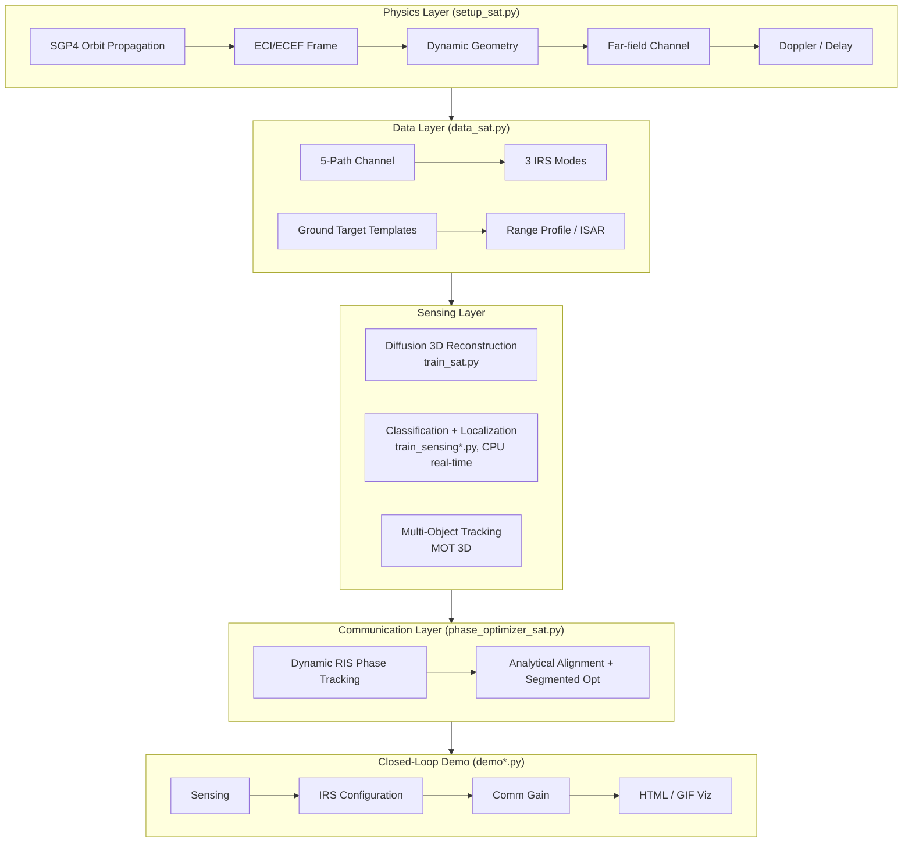
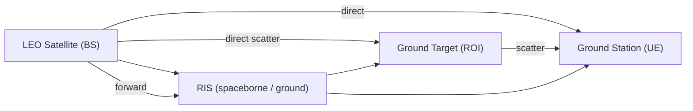

# 🛰️ IRS-Diffu-ISAC

**English** · [简体中文](README.zh-CN.md)

[](https://github.com/ConradLu2740/IRS-Diffu-ISAC/actions/workflows/ci.yml)
[](https://www.python.org/)
[](https://pytorch.org/)
[](LICENSE)
[](https://github.com/ConradLu2740/IRS-Diffu-ISAC/releases)
[](https://colab.research.google.com/github/ConradLu2740/IRS-Diffu-ISAC/blob/main/colab/isac_demo.ipynb)

**A certificate-carrying testbed for RIS-aided space ISAC — every claim ships with its proof, its bound, or its falsification.**

Real LEO orbits (SGP4) · dynamic RIS phase optimization · diffusion & flow-matching generative sensing · sensing–communication closed loop · OTFS/AFDM against the real ±611 kHz Doppler · and a verification suite where every headline number is either **certified**, **bracketed**, or **falsified in public**.

> 🎯 **A school research project that grew into a falsifiable-testbed**: physics-grounded, reproducible, demo-ready — and honest about what is *not* true (see the **Wall Map** section below).

---

## 🎯 The Thesis

Most ISAC papers report numbers without reporting the *conditions under which those numbers hold*. This repo takes the opposite contract: **pre-register the claim, then verify it — including when verification says no.**

| | |
|---|---|
| 🔬 **19 verification scripts** | orbit physics, RIS SDR optimality bracket, ODE convergence order, Lipschitz constants, CRB floors, Pareto frontiers, DP scheduling certificates, information ladders — each with fixed seeds, JSON evidence, and PASS/FAIL verdicts |
| 📉 **10+ falsified predictions** | SDR gain overestimated an order of magnitude; Hessian-weighted loss dead (value function is a step function); free-bits dead (no posterior collapse); critical SNR −8 dB → measured −31.2 dB; "OFDM SIR ≤ 5 dB" → 11.7 dB; FM advantage at equal NFE non-monotonic — all reported, none hidden |
| 🧱 **The Wall Map** | four independent methods (information theory, power accounting, global optimization, estimation theory) converge on the same guidance for the field: *calibration and geometry, not phase algorithms* |

**Headline, in one sentence**: at matched quality, flow matching needs **50–100× fewer network evaluations** than diffusion (1–10 ODE steps vs 100 ancestral steps; Euler order −0.87, trajectory straightness 176×, crossover NFE≤2) — and a 3-seed paired A/B shows the two paradigms are *statistically indistinguishable in quality* at this training scale, locating the remaining 15–20× gap to the VAE ceiling in the VAE/training scale rather than the generative objective. The closed loop provably reaches ≈69% of a *certified* global optimum (CI [0.638, 0.745]; ≈74% with the FM-shape prior).

---

## 🧭 For Peers (TL;DR)

**What this is** — an open, physics-grounded **reference implementation of RIS-aided ISAC**:
real LEO orbits (SGP4) → dynamic RIS phase tracking → sensing from communication signals →
closed-loop demo. All data & weights are **synthetically generated in-code** — clone, `make setup`, done; **no data download needed**.

**What you can do with it**
- **Reproduce** headline results (RIS tracking **+173%**, closed-loop comm gain **+374%**; v1.7 physics-consistency audit values, see `docs/physics_audit_table.md`) in minutes
- **Extend** it: swap satellite / frequency band / target templates / your own model
- **Compare** with classical baselines (2D-CFAR + MUSIC, `make baseline`) or with the strong generative baselines (DDIM few-step, progressive distillation, `make verify-baselines`)

**Fastest path**
```bash
make setup    # ~2-3 min, once
make verify   # 1 min physics self-check (ALL PASS)
make demo     # auto-train + sensing–comm closed-loop
```

Command map: `make help` · script-by-script cards: [`source_code/isac_sat/README.md`](source_code/isac_sat/README.md) · parameter recipes: [`configs/README.md`](configs/README.md) · optimization roadmap & pre-registered propositions: [`docs/optimization_roadmap.md`](docs/optimization_roadmap.md)

---

## 🧱 Full-Pipeline Reference Library (`isac_sim/`, new)

Beyond the space-ground showcase above, this repo is growing into a **layered, pluggable simulation reference for the ISAC full pipeline** — swap any layer, reuse any layer:

```text
isac_sim/
├── channels/     # L0 free-space (default) → L1 Rician (K-factor, power-aligned) → L2 3GPP TR 38.811 NTN (planned)
├── waveforms/    # OFDM sensing waveform (default) → OTFS / AFDM (implemented, ICI identity verified)
├── ris/          # continuous phase (default) · 1-bit binary · segmented reconfiguration (K-sweep, model-agnostic)
├── comm/         # QPSK-over-AWGN minimal link (measured BER vs theory)
├── sensing/      # 1D CA-CFAR (vectorized) · 2D-CFAR/MUSIC/ML adapters (planned)
├── tracking/     # nearest-neighbor + CV minimal tracker (Hungarian MOT lives in isac_sat)
├── findings/     # analytic-bound negative results: far-field angle wall (with required-aperture formula)
└── stacks/       # cross-stack validation plan: Sionna cross-check + MATLAB reference implementations
```

**Design rules**: numpy-only core (no torch needed for the classic layers) · every module ships a physics sanity check + one `make` command + CI smoke before landing · `source_code/isac_sat` stays as the reference application on top.

Run the layered smoke suite (seconds, CPU):
```bash
make smoke-sim
```

---

## 🚀 60-Second Experience (Zero Setup)

[](https://colab.research.google.com/github/ConradLu2740/IRS-Diffu-ISAC/blob/main/colab/isac_demo.ipynb)

Click the badge to run in **Google Colab** — clone → install → real satellite orbit verification → sensing–communication closed-loop demo → animated GIF. No local environment needed.

Run locally? See [Quick Start](#-quick-start).

---

## ✨ Highlights

| | |
|---|---|
| 🛰️ **Real Orbit Simulation** | SGP4 propagation of real LEO satellites (ISS / Starlink TLE), dynamic geometry + Doppler + delay, physics-verified against real values |
| 📡 **Dynamic RIS Phase Tracking** | Full-model closed-form phase alignment (direct path + both RIS paths), frame-by-frame tracking power **+173%** (K=1; coordinate-ascent reachable value +256% — a *lower* bound on the global optimum, certified design-factor interval [0.73, 0.83], see TECH_REPORT v1.11 §6.7); segmented tracking (K=2/4/8) quantifies the "RIS reconfiguration rate vs channel coherence time" trade-off — K=8 gain largely shrinks |
| 🎯 **Sensing–Communication Closed-Loop** | Sense targets from communication signals (classification + localization) → auto-configure IRS → communication power **+374%** (73.3% of the ideal closed-form oracle) |
| 🚁 **Multi-Object Tracking in 3D** | Simultaneously track **10 moving targets** (car / drone / bicycle / pedestrian / train) with **full 3D trajectories** — drones in the air, ground targets locked to the ground |
| 🖥️ **Interactive Demos** | Single-file HTML players (scene switching / timeline / real UTC overpass time) + GIF animations, shareable with a double-click |
| 📻 **SDR Interface** | IQ data format + ingest pipeline (time-domain IQ → FFT → range profile, fidelity 0.998), hardware-ready (RTL-SDR / USRP) |
| 🧪 **Reproducible Verification** | Physics checks, tracking trade-offs, multi-target sensing, multi-orbit / Ka-band robustness — all one-command scripts |

---

## 🎬 Demos

### 1. Sensing–Communication Closed-Loop
Satellite overpass → sense the target → IRS auto-pointing → communication power boost.


- 🖥️ Interactive (multi-scene): [`demo_live.html`](source_code/isac_sat/isac_demo/demo_live.html)
- 🎬 Generate: `python demo_live.py` / `python make_animation.py`

### 2. Multi-Object Tracking in 3D (MOT)
10 moving targets of 5 types — **drones fly in the air, ground targets stay locked to the ground** (z-constrained).


- 🖥️ Interactive 3D (rotate / zoom / hover): [`mot_3d.html`](source_code/isac_sat/isac_demo/mot_3d.html) — **open this file and see the full 3D scene!**
- 🎬 Generate: `python demo_mot_html.py`

---

## 📊 Key Results

| Experiment | Result |
|------------|--------|
| Orbit physics verification (ISS) | Altitude 418 km / velocity 7.66 km/s / period 92.9 min (matches real values) |
| Overpass Doppler (30 GHz) | −610 ~ +610 kHz (S-curve, real LEO order of magnitude) |
| RIS dynamic tracking | Frame-by-frame power **+173%** (K=1, full-model closed form; coordinate-ascent reachable value +256% = lower bound on global optimum, certified interval [0.73, 0.83]); K=8 segmented **+16%** (−8% at the coordinate-ascent value) |
| Wideband HRRP classification | **0.80** (5-class templates; early 6-class experiments: 0.383 → 0.867 → ISAR 0.933) |
| Sensing–comm closed-loop (single) | Classification 80%, comm gain **+374%** (73.3% of the ideal closed-form oracle) |
| Sensing–comm closed-loop (multi) | Detection 0/2 (single scene), IRS pointing gain **+577%** (86% of the ideal closed-form oracle) |
| Multi-target tracking (MOT) | 10 targets / 5 classes, detection recall **0.60**, trajectory class accuracy 0.73 |
| DETR-ized detector (S1–S3) | DETR-style head + calibrated objectness: MOT recall **0.758** / RMSE **0.1860** vs original 0.699 / 0.2010 (+8.4% / −7.5%); objectness beats max-softmax (F1 0.841 vs 0.727 @ same recall) |
| Classic baseline (2D-CFAR) | Detection **100%** (P_fa=1e-4), along-line-of-sight localization RMSE **8.1 m** — no training needed |
| Classic baseline (MUSIC) | ULA-8 target direction MAE **0.017°** (synthetic snapshots); far-field angle resolution physically insufficient for intra-ROI localization |
| ML vs classic (fair) | ML (absolute-range feature) LOS RMSE **2.3 m** vs CFAR 8.1 m; centroid-relative feature = class prior only (2D RMSE 22.6 m); feature bug fixed (`center='roi'`) |
| Multi-orbit / Ka-band | ISS / Starlink ×30 / 28 GHz all PASS, physics consistency verified |
| DP-optimal RIS reconfiguration | Uniform K suboptimality gap **40.1% (K=2) / 42.1% (K=4)** exact; exhaustive-search certificate 0.00e+00; drift non-uniformity ratio median 9.26 |
| Sensing-comm Pareto frontier (finding) | σ_cross(R) = 40.97/(2^R−1) closed form (slope −1.0000, R²=1.0); break-wall 5.3 m ⇔ R≥3.13 bps/Hz; multi-frame fusion G(8)=6.95–8.15 |
| HRRP information floor (finding) | Single-scatterer path CRB **0.5165 mm** (MC/CRB=0.984); assumed σ_ρ=0.15 m is **290× conservative** → 0.34 m two-station RMSE is model-limited, not information-limited |
| Pilot FIM / η_est | genie-CSI harmlessness certified: η_est(17)=**0.9999994**; 50%-loss critical SNR −31.2 dB; joint optimum K=1, n_p=17 |
| Information audit | Fano ladder **0.19 / 1.71 / 2.07 bit** (narrowband→HRRP→ISAR); Van Trees λ⊥/λ∥~6.6e-9 (angle wall); conditional-encoder collapse fixed (lr_cond 1e-3→1e-4); **HRRP conditioning opens the channel: Δ(0)=0.302** (6× the pre-registered threshold, monotone in t, 21.8% variance explained); FM NFE=1 beats DDPM NFE=100 by −14% under HRRP conditioning |
| **Flow Matching vs DDPM at equal compute** | FM NFE=1 beats DDPM NFE=100 on the same architecture/data: CD 0.2922 vs 0.4055–0.4326 (unconditional); **0.2269 vs 0.2637 (−14%)** under HRRP conditioning (C1); C2 dual-domain fusion falsified (0.2269 → 0.2752 — narrowband dilutes) |
| **FM shape beats box prior** | FM NFE=1 generative shape replaces the hand-crafted box ROI in the closed loop: η_sense **0.840 → 0.932** (+10.9%), voxel ℓ1 error **0.58×**; η_total → ≈0.736; `make verify-fm-shape` / `demo.py --fm_shape <ckpt>` |
| **1-step distilled FM student** | Progressive distillation of the C1 HRRP-conditional FM: the CD advantage is **batch-specific** (−23.4% on one batch, +65.6% worse on an independently seeded one — n_eval=8 variance dominates); the robust finding is **diversity**: the NFE=1 teacher is near-mode-collapsed (ratio 0.02, effectively a conditional-mean estimator), the student restores **9×** sample diversity by regressing the teacher's 2-step midpoint outputs; `make train-fm-distill` / `make verify-fm-distill-diversity` |
| OTFS/AFDM vs real Doppler | ICI identity **28.35%** @ ±611 kHz (MC 10⁶); OTFS BER **0** vs OFDM 7.7e-2 (equal SNR); ISAR frozen-geometry threshold 32.3 Hz vs actual ≥2.53 kHz (**78× violation**) |
| XL-array DOA escapes the range wall (NF-2/3) | 1 m coherent aperture, far-field DOA CRB **387 mm** @ 1 km — **30×** better than the 11.84 m range-profile wall; robust to 5° phase-calibration noise (38% CRB efficiency); near-field curvature falsified as low-value — geometry line closes, NF-4 (low-altitude loop) registered |
| Differentiable sensing pipeline | Soft-voxel relaxation makes phase design + evaluated power differentiable in target position: autograd = FD (4/4 seeds, G1 PASS); Danskin smooth limit flat (G2 FAIL, κ≈0) — kept as end-to-end infrastructure, estimator-side weighting falsified twice |
| Angle-wall scan (finding) | Resolving the 80 m ROI needs a 77 m aperture (N≈15,394) — shortfall **1889×** at N=8; wall active in all practical configs |
| Two-station trilateration (finding) | Cross-range RMSE **0.34 m** @ default geometry (γ=131°, σ_ρ=0.15 m, 3D slant-range model) — **~35×** better than the 11.8 m mono-static wall; break-wall budget σ_ρ < 5.3 m |

> ⚠️ **Honest notes**: absolute attitude estimation is **not feasible** (physical upper bound) for far-field star–ground links with simple symmetric templates; single-station multi-target **classification** is limited by signal mixing (detection/localization works).

> 🔢 **Rounded values**: README figures are rounded for readability; exact reproducible values and the v1.7 old→new audit diff are in TECH_REPORT v1.7 and `docs/physics_audit_table.md`.

---

## 🧱 The Wall Map — where this scenario *cannot* be pushed

Most papers end at their best result. This repo also maps its walls — **four independent methods (information theory, power accounting, global optimization, estimation theory) converge on the same guidance**: in this geometry, the next gains are in **calibration, deployment, and geometry** — *not* in RIS-phase algorithms, and *not* in estimator efficiency on observable directions.

| Wall | Statement (with certificate type) | Consequence for the field |
|---|---|---|
| **① Far-field angle wall** | The 80 m ROI subtends 0.0066° at ~695 km slant range; resolving it needs a 77 m aperture (N≈15,394 — **1889× shortfall** at N=8). *Exact geometric bound*; Van Trees eigenvalue ratio λ⊥/λ∥ ~ **6.6e-9** confirms it information-theoretically | Mono-static cross-range is physically unavailable; escapes are two-station trilateration (0.34 m, CRB-proven deployment Δaz=90°) or near-field XL-RIS (designed, unbuilt) |
| **② Power gate (RIS carries no sensing echo)** | In the spaceborne mode the RIS-reflected echo is **~9×10²⁰× weaker** than the communication signal; the sensing observation is structurally independent of the RIS phase. *Structural identity + power accounting* | **Negative theorem**: no sensing–communication trade-off exists in the phase dimension here; joint *phase* design is vacuous — the only coupling point is the decision layer. Don't search for joint RIS waveforms in this geometry |
| **③ Information floor (290× conservatism)** | The HRRP single-scatterer path-length CRB is **0.5165 mm** (MC/CRB = 0.984); the σ_ρ = 0.15 m assumed in published two-station results is **290× more conservative**. *CRB theorem + MC verification* | The 0.34 m two-station RMSE is **model/calibration-limited, not information-limited**; effort belongs in error-budget decomposition (incl. Ka-band ionosphere 2–20 m > the 5.3 m break-wall budget), not in better estimators |
| **④ Phase-design near-optimality** | Coordinate ascent already reaches **88.05%** of a *certified* global bound (SDR + Lagrangian dual, 32/32 frames valid); certified design factor η_design\* ∈ **[0.732, 0.832]**; uniform-K reconfiguration gap is exactly 40.1%/42.1% at K=2/4. *Dual-bound certificate + exhaustive-search certificate* | RIS phase algorithms are near their ceiling in this scenario; the remaining closed-loop gap (η_total ≈ 0.69) is dominated by the **sensing/box-prior side**, not the optimizer |

**Two more walls found by the gates**: the closed-loop value function is a **step function** of the sensed position at the ROI-voxel scale (±2 m moves power +59%/−38%) — so estimator-side reweighting theories don't apply to the deployed pipeline (bottleneck = box prior); and the conditional side-information gap is still ~0 after the collapse fix (lr_cond 1e-3→1e-4 restored condition sensitivity 4×10⁴-fold, but Δ(t)≈0 at 256 samples/100 epochs — G15 partially falsified; the FM-vs-DDPM comparison is unaffected and the headline strengthened: FM NFE=1 CD 0.292 vs best DDPM 0.406–0.433).

**Why publish walls?** Because four independent certificate types agreeing is stronger evidence than any single positive result — and it tells the community where *not* to spend the next three years. Full derivations and falsifiable protocols: [`docs/optimization_roadmap.md`](docs/optimization_roadmap.md) · technical report: [`TECH_REPORT.md`](TECH_REPORT.md) v1.12 §6.7–6.8.

---

## 📊 Comparison with Related Open-Source Projects


*Capability coverage across 8 dimensions (full coverage = 2/2). Radar source: [`assets/make_comparison_radar.py`](assets/make_comparison_radar.py).*

**Feature coverage vs. representative open-source projects** in ISAC / RIS / diffusion-3D (checked Aug 2026):

| Capability | **IRS-Diffu-ISAC** | [5G ISAC Sys-Level](https://github.com/xds0112/5G_based_System_level_Integrated_Sensing_and_Communication_Simulator) | [ISAC-PLM (802.11ay)](https://github.com/wigig-tools/isac-plm) | [PassiveDOA-ISAC-RIS](https://github.com/chenpengseu/PassiveDOA-ISAC-RIS) | [Diffusion 3D (PVD)](https://github.com/luost26/diffusion-point-cloud) |
|---|---|---|---|---|---|
| Scenario | **Space ISAC (LEO/NTN)** | 5G NR cellular | 60 GHz WiGig | Ground RIS sensing | Generic 3D point cloud |
| Language / Stack | **Python · PyTorch** | MATLAB | MATLAB | MATLAB | PyTorch |
| RIS modeling | ✅ **dynamic phase tracking** | ❌ | ❌ | ✅ passive DOA | ❌ |
| Diffusion 3D reconstruction | ✅ **conditional LDM** | ❌ | ❌ | ❌ | ✅ |
| Sensing–communication closed loop | ✅ **end-to-end demo** | ⚠️ framework | ⚠️ PHY-level | ❌ | ❌ |
| Real LEO orbit (SGP4) | ✅ | ❌ | ❌ | ❌ | ❌ |
| Multi-object 3D tracking | ✅ | ❌ | ❌ | ❌ | ❌ |
| SDR data interface | ✅ | ❌ | ⚠️ | ❌ | ❌ |
| Reproducible physics verification | ✅ (CI) | ✅ | ✅ | ⚠️ | ✅ |
| Instant demo (Colab / HTML / GIF) | ✅ | ❌ | ⚠️ | ❌ | ✅ |

> ⚠️ **Fairness note**: each project runs its own simulation setup, so absolute metric values are **not directly comparable across rows** — the table above compares *feature coverage and engineering depth*, not benchmark scores.

**Reported metrics** (each project's own setting, for reference only):

| Project | Reported metrics |
|---|---|
| **IRS-Diffu-ISAC** | HRRP classification **0.80** (5-class) · closed-loop comm gain **+374%** · RIS tracking **+173%** (K=1) · MOT recall **0.60** · 2D-CFAR detection 100%, LOS RMSE 8.1 m · 3D reconstruction CD 0.137–0.183 (space ISAC; vs 0.233 without RIS) · **Flow Matching: NFE=1 beats diffusion NFE=100 on all metrics in all 3 IRS modes** (CD −22~−33%; Euler order −0.87; 50–100× fewer sampling steps; certified design-factor interval [0.73, 0.83]; η_total 0.694±0.108) |
| PVD (ShapeNet) | CD ~1.5e-3 on ShapeNet — standard *generation* benchmark, different task (unconditional 3D generation, no channel/ISAC physics) |
| ISAC-PLM | Link-level sensing MSE / NMSE for 60 GHz 802.11ay (short-range PHY layer) |
| 5G ISAC System-Level | 5G NR system-level simulation (sensing via 2D-CFAR / MUSIC, cellular scenario) |

---

## 🧭 Architecture



**Signal model** (5 propagation paths):



---

## 🚀 Quick Start

> 💡 All commands are one-liners via [`Makefile`](Makefile) — **data & weights are generated in-code, nothing to download.**

```bash
# 1. Environment (first time only, ~2-3 min)
make setup

# 2. Physics self-check: orbit / Doppler / channel (~1 min)
make verify

# 3. One-shot sensing–communication closed-loop demo (auto-trains the sensing model)
make demo

# 4. Everything else
make help               # full command map
make demo-live          # interactive multi-scene HTML player
make demo-anim          # GIF animation
make demo-multi         # multi-target closed loop
make track              # RIS dynamic tracking trade-off
make sdr                # SDR pipeline demo (no hardware)
make mot                # 10-target 3D MOT (train + track + HTML)
make baseline           # classic baseline comparison (2D-CFAR + MUSIC)
```

Manual fallback (same commands, no `make`):
```bash
python3 -m venv .venv
.venv/bin/pip install -r requirements.txt
cd source_code/isac_sat
../../.venv/bin/python verify_sat.py          # 1. physics verification
bash run_demo.sh                              # 2. closed-loop demo (auto-train)
../../.venv/bin/python demo_live.py --n_scenes 3
../../.venv/bin/python make_animation.py      # 3. live demos
../../.venv/bin/python train_sensing_multi.py --wideband && ../../.venv/bin/python demo_multi.py
../../.venv/bin/python verify_tracking.py     # 4. RIS tracking trade-off
../../.venv/bin/python demo_sdr.py            # 5. SDR pipeline
../../.venv/bin/python train_detect.py --n_scenes 25 --epochs 50 && ../../.venv/bin/python demo_mot.py && ../../.venv/bin/python demo_mot_html.py
```

Per-script purpose / output cards: [`source_code/isac_sat/README.md`](source_code/isac_sat/README.md)

---

## 🔧 How to Adapt It to Your Own Scenario

| Want to change | Where | Note |
|---|---|---|
| Satellite / orbit | `source_code/isac_sat/setup_sat.py` (TLE constants) | ISS (25544) & Starlink (44714) built-in; use any NORAD ID |
| Frequency band | `FC_HZ` in `setup_sat.py` | default 30 GHz mmWave; Ka-band check in `verify_robustness.py` |
| Target templates | `_template_*()` in `data_sat.py` | car / uav / building / tank / tower / cubesat / bicycle / pedestrian / train |
| Your own model | the `nn.Module` in a training script | input dim from `channels.frame_cond_dim()` |
| Antenna array | `--bs_ant` / `--ue_ant` | CLI, no code change |

Recipes & parameter quick-reference: [`configs/README.md`](configs/README.md)

## 🗺️ Roadmap

- [x] LEO satellite dynamic simulation (SGP4 real TLE, Doppler, delay)
- [x] Dynamic RIS phase tracking + reconfiguration-rate trade-off
- [x] Sensing–communication closed loop (single / multi-target)
- [x] Wideband HRRP / ISAR sequence sensing
- [x] 3D multi-object tracking (10 targets, 5 classes)
- [x] SDR IQ data interface + ingest pipeline
- [x] Colab one-click experience + CI + GitHub promotion
- [x] **`isac_sim/` layered reference library skeleton** (channels / waveforms / RIS / comm / sensing / tracking / findings / stacks, numpy-only, smoke-tested)
- [x] **K-sweep robustness under Rician fading** (`verify_tracking_rician.py`: K=10/5/0 dB × 5 seeds — qualitative conclusion holds; `make track-rician`)
- [x] **Sionna 2.x CDL standard-channel cross-validation** (`verify_sionna_channel.py`: 3GPP TR 38.901 CDL-D, K≈9 dB — flat-fading & per-frame-independence approximations quantified, K-sweep confirmed at the standard K; `make verify-sionna`, optional dep `pip install sionna`)
- [ ] **`isac_sim/channels` L2 full NTN alignment**: 3GPP TR 38.811 NTN-specific profiles (geometry-dependent delay/angle spreads); re-run closed loop under L2
- [x] **DP-optimal RIS reconfiguration scheduling**（精确最优重构时刻 + 穷举证书；均匀 K 次优性精确间隙 40.1%/42.1%；`make verify-tracking-dp`）
- [x] **Sensing-communication Pareto frontier**（闭式 σ(R)=40.97/(2^R−1) + 多帧融合 + HRRP 信息底噪 0.5165mm；`make verify-pareto`）
- [x] **Pilot-FIM / η_est 三相分解**（genie-CSI 无害认证 η_est(17)=0.9999994；`make verify-fim`）
- [x] **Information audit**（Fano 阶梯 0.19/1.71/2.07 bit；发现条件编码器坍塌，CFG 近无效；`make verify-info-audit`）
- [x] **`isac_sim/findings` angle-wall scan + two-station counter-example**: shortfall heatmap, break-the-wall budget (σ_ρ < 5.3 m @ default geometry), rank-deficiency warning (`make finding-angle-wall`, `make twostation`)
- [ ] **`isac_sim/comm` link upgrade**: higher-order QAM / simple coding / spectral-efficiency metrics
- [x] **`isac_sim/channels` × Sionna cross-validation** (v1.6, see above)
- [ ] **`isac_sim/stacks` further cross-validation**: MATLAB reference implementations for key modules
- [ ] **GEO / MEO orbit support** (currently LEO-focused)
- [ ] **Real SDR over-the-air capture** (RTL-SDR / USRP backend)
- [ ] **Space debris / satellite geometry targets** (replace simple templates)
- [ ] **On-board computational constraints**: model distillation / quantization
- [ ] **Low-SNR robustness** evaluation suite
- [x] **OTFS / AFDM waveform extension**（多普勒韧性波形：ICI 恒等式 28.35% 实测验证，OTFS BER=0 vs OFDM 7.7e-2 @ 真实 ±611 kHz 多普勒；`isac_sim/waveforms/otfs.py`+`afdm.py`，`make verify-waveforms`）
- [x] **Flow-matching generative baseline**（2026 trend — 与扩散等算力公平对比：FM NFE=1 在三模式全指标胜 DDPM NFE=100；`make compare-gen` / `make train-fm` / `make verify-fm-bounds`；收敛阶、曲率、crossover 见 `verify_fm_bounds.py`）

---

## 📁 Project Structure

```
IRS-Diffu-ISAC/
├── Makefile                        # 🆕 one-command entry: make setup / verify / demo / ...
├── isac_sim/                       # 🆕 layered ISAC simulation reference library (numpy-only core)
│   ├── channels/ waveforms/ ris/ comm/ sensing/ tracking/
│   ├── findings/                   # analytic-bound findings (far-field angle wall)
│   └── stacks/                     # Sionna cross-check + MATLAB reference plan
├── tests/                          # 🆕 layered smoke suite (make smoke-sim)
├── pyproject.toml                  # 🆕 metadata + dependency declaration
├── configs/                        # 🆕 parameter quick-reference + experiment recipes
│   └── README.md
├── requirements.txt
├── source_code/
│   ├── isac_sat/                   # Space-ground ISAC + sensing + demo (active)
│   │   ├── README.md               # 🆕 per-script usage cards (purpose / command / output)
│   │   ├── setup_sat.py / data_sat.py / train_sat.py / eval_sat.py
│   │   ├── phase_optimizer_sat.py / task_sat.py
│   │   ├── train_sensing*.py          # Sensing (classification + localization)
│   │   ├── mot_data.py / mot_tracker.py / train_detect.py / demo_mot*.py  # 3D MOT
│   │   ├── sdr_io.py / sdr_ingest.py  # SDR data interface (IQ / ingest)
│   │   ├── demo*.py / make_animation.py / run_demo.sh
│   │   └── isac_demo/                 # checkpoints + HTML players + GIFs
│   └── legacy/                        # Original project (RIS + diffusion 3D recon, archived)
├── colab/                             # One-click Colab notebook
├── archive/
│   ├── source_code.zip                # Historical snapshot
│   └── original-docs/                 # Original project docs (architecture.md / Code_Wiki.md / figures)
├── space_isac_design.md               # Full design document (physics, results, pitfalls)
├── docs/
│   ├── optimization_roadmap.md        # Four-angle optimization roadmap (measured results + pre-registered propositions)
│   ├── arxiv_report_outline.md
│   └── physics_audit_table.md
├── CONTRIBUTING.md
├── README.md / README.zh-CN.md
└── LICENSE
```

> 🆕 `legacy/` and `archive/` are **historical archives** — for new work go to `source_code/isac_sat/`.

---

## 📚 Documentation

- **[TECH_REPORT.md](TECH_REPORT.md)** — arXiv-ready technical report: system model, closed-loop results, classical baselines (2D-CFAR + MUSIC), physical findings
- **Versioning**: git release tags (currently `v1.2.0`) mark repo milestones; the report has its own version (currently **v1.12**). Current mapping: **tag `v1.2.0` ↔ TECH_REPORT v1.5** (Sections 6.3/6.4: Rician robustness + two-station escape from the angle wall); the current mapping is **tag `v1.3.0` ↔ TECH_REPORT v1.12** (flow-matching equal-compute comparison with certificates, strong baselines, generalization, SDR optimality bracket, 16-seed decomposition, DP scheduling, Pareto frontier, information audit, OTFS/AFDM); the **Markdown report is authoritative** (`TECH_REPORT.md`), the `.tex` is a stale auto-conversion.
- **[space_isac_design.md](space_isac_design.md)** — complete design: physical model, experiments, physical conclusions, pitfalls
- **[docs/optimization_roadmap.md](docs/optimization_roadmap.md)** — four-angle optimization roadmap (math architecture / optimization theory / information theory / mobile communications), with measured results, falsified predictions, and a pre-registered proposition table
- Original project docs (archived): [`archive/original-docs/`](archive/original-docs/) — [`architecture.md`](archive/original-docs/architecture.md) / [`Code_Wiki.md`](archive/original-docs/Code_Wiki.md)
- **[CONTRIBUTING.md](CONTRIBUTING.md)** — how to contribute

## Tech Stack

`Python · PyTorch · SGP4 · NumPy/SciPy · Matplotlib · scikit-learn`

## 🤝 Contributing

Found a bug? Have an idea? Check out [CONTRIBUTING.md](CONTRIBUTING.md) and open an [issue](https://github.com/ConradLu2740/IRS-Diffu-ISAC/issues) or [PR](https://github.com/ConradLu2740/IRS-Diffu-ISAC/pulls). All contributions welcome!

**If this project is useful for your research or engineering, give it a ⭐ — it helps more people find it!**

## Citation

If you use this project in your research:

```bibtex
@misc{irsdiffuisac2026,
  title  = {IRS-Diffu-ISAC: A Certificate-Carrying Testbed for RIS-Aided Space ISAC},
  author = {Lu, Conrad},
  year   = {2026},
  howpublished = {\url{https://github.com/ConradLu2740/IRS-Diffu-ISAC}}
}
```

## License

[MIT](LICENSE) © 2026 Conrad Lu
