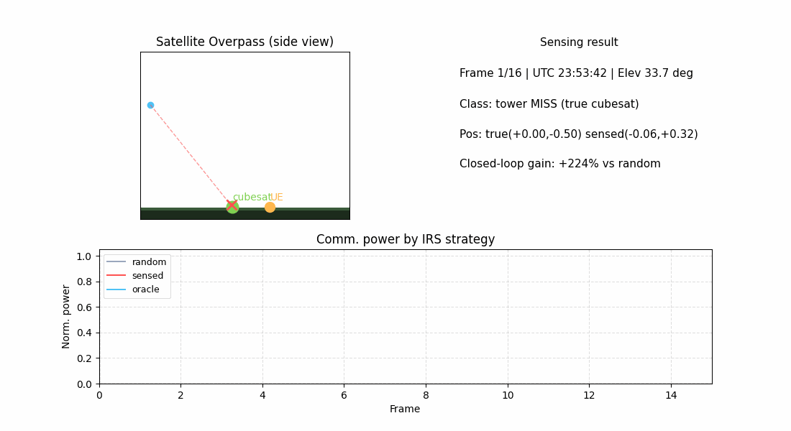

# 🛰️ IRS-Diffu-ISAC

[](https://github.com/ConradLu2740/IRS-Diffu-ISAC/actions/workflows/ci.yml)
[](https://www.python.org/)
[](LICENSE)
[](https://colab.research.google.com/github/ConradLu2740/IRS-Diffu-ISAC/blob/main/colab/isac_demo.ipynb)

**RIS 辅助通感一体化（ISAC）· 从扩散模型 3D 重建到太空 ISAC（ISAC-NTN）工程闭环**

Intelligent Reflecting Surface (RIS) aided **Integrated Sensing and Communication (ISAC)**
— powered by Conditional Latent Diffusion Models for 3D point cloud reconstruction,
extended to **space-based ISAC** with LEO satellites, dynamic RIS tracking, and an
**end-to-end sensing–communication closed-loop demo**.

---

## 🚀 60 秒体验（零配置）

[](https://colab.research.google.com/github/ConradLu2740/IRS-Diffu-ISAC/blob/main/colab/isac_demo.ipynb)

点击上方按钮在 **Google Colab** 打开体验笔记本，自动完成：
克隆仓库 → 装依赖 → 真实卫星轨道验证 → 感知-通信闭环 demo → 生成演示 GIF。无需本地环境。

也可以本地运行（[快速开始](#-快速开始)）。

---

## ✨ 核心亮点

| | |
|---|---|
| 🛰️ **真实轨道仿真** | SGP4 传播真实 LEO 卫星（ISS / Starlink TLE），动态几何 + 多普勒 + 时延，物理验证与真实轨道吻合 |
| 📡 **RIS 动态相位跟踪** | 解析相位对齐，逐帧跟踪功率 **+283%**；分段跟踪量化"RIS 重构速率 vs 信道相干时间"权衡 |
| 🎯 **感知-通信闭环** | 通信信号感知目标（分类 + 定位）→ 自动配置 IRS → 通信功率 **+233%**（达成理想优化 98%） |
| 🖥️ **实时演示** | 单文件 HTML 播放器（多场景切换 / 时间轴 / UTC 真实过境时间）+ GIF 动画 |
| 📻 **SDR 接口** | IQ 数据格式 + 导入管线（时域 IQ → FFT → 距离像，保真 0.998），硬件预留（RTL-SDR/USRP） |
| 🧪 **可复现验证** | 物理验证、跟踪权衡、多目标感知、多轨道/Ka 频段鲁棒性——全部脚本可一键运行 |

---

## 🎬 Demo

**感知-通信闭环实时演示**：卫星过境 → 感知目标 → IRS 自动指向 → 通信质量提升。



- 🖥️ 交互版（多场景切换）：`source_code/isac_sat/isac_demo/demo_live.html`
- 🎬 视频版：`source_code/isac_sat/isac_demo/demo_animation.gif`
- 🔄 生成：`python demo_live.py` / `python make_animation.py`

---

## 📊 关键结果

| 实验 | 结果 |
|------|------|
| 轨道物理验证（ISS） | 高度 418 km / 速度 7.66 km/s / 周期 92.9 min（与真实值吻合） |
| 过境多普勒（30 GHz） | -610 ~ +610 kHz（S 型曲线，真实 LEO 量级） |
| RIS 动态跟踪 | 逐帧跟踪功率 **+283%**；K=8 分段（重构受限）增益消失 |
| 宽带 HRRP 目标分类 | **0.867**（窄带 0.383 → 宽带 0.867 → ISAR 序列 0.933） |
| 感知-通信闭环（单目标） | 分类 83%，通信增益 **+233%**（oracle 达成率 98%） |
| 感知-通信闭环（多目标） | 检测 2/2，IRS 指向增益 **+289%**（oracle 达成率 94%） |
| 多轨道 / Ka 频段 | ISS / Starlink × 30 / 28 GHz 全 PASS，物理一致性验证 |

> ⚠️ 诚实标注：星-地远场 + 简单对称模板下，**绝对姿态估计不可行**（物理上界）；单站多目标**分类**受信号混合限制（检测/定位可用）。

---

## 🧭 架构

```
┌─────────────────────────────────────────────────────────────┐
│ 物理仿真层（setup_sat.py）                                    │
│  SGP4 轨道 → ECI/ECEF → 动态几何 → 远场信道 → 多普勒/时延       │
├─────────────────────────────────────────────────────────────┤
│ 数据层（data_sat.py）                                         │
│  5 路径信道 · 3 种 IRS 模式 · 地面目标模板 · 距离像/ISAR 序列     │
├─────────────────────────────────────────────────────────────┤
│ 感知层                                                        │
│  扩散模型 3D 重建（train_sat.py）                               │
│  目标分类 + 定位（train_sensing*.py，CPU 实时）                  │
├─────────────────────────────────────────────────────────────┤
│ 通信层（phase_optimizer_sat.py）                              │
│  RIS 动态相位跟踪（解析对齐 + 分段优化）                        │
├─────────────────────────────────────────────────────────────┤
│ 闭环演示层（demo*.py）                                         │
│  感知 → IRS 配置 → 通信增益 → HTML/GIF 可视化                  │
└─────────────────────────────────────────────────────────────┘
```

**信号模型**（5 条传播路径）：

```
LEO 卫星(BS) ──→ 地面目标(ROI) ──→ 地面站(UE)
    │                 │
    └──── RIS（星载/地面）───┘
路径: 直达散射 + 2×IRS反射 + 2×IRS前向
```

---

## 🚀 快速开始

```bash
# 环境
python3 -m venv .venv
.venv/bin/pip install -r requirements.txt

cd source_code/isac_sat

# 1. 物理验证（轨道/多普勒/信道，~1 min）
../../.venv/bin/python verify_sat.py

# 2. 一键闭环 demo（自动训练感知模型 + 运行闭环）
bash run_demo.sh

# 3. 实时演示（HTML 播放器 + GIF 动画）
../../.venv/bin/python demo_live.py --n_scenes 3
../../.venv/bin/python make_animation.py

# 4. 多目标感知闭环
../../.venv/bin/python train_sensing_multi.py --wideband
../../.venv/bin/python demo_multi.py

# 5. RIS 动态跟踪权衡
../../.venv/bin/python verify_tracking.py

# 6. SDR 数据管线（无硬件：模拟 IQ → 回放感知）
../../.venv/bin/python demo_sdr.py
```

---

## 📁 项目结构

```
IRS-Diffu-ISAC/
├── source_code/
│   ├── isac_sat/                      # 星-地 ISAC + 感知 + demo（活跃工作区）
│   │   ├── setup_sat.py / data_sat.py / train_sat.py / eval_sat.py
│   │   ├── phase_optimizer_sat.py / task_sat.py
│   │   ├── train_sensing*.py          # 感知（分类+定位）
│   │   ├── sdr_io.py / sdr_ingest.py  # SDR 数据接口（IQ 格式/导入）
│   │   ├── demo*.py / make_animation.py / run_demo.sh
│   │   └── isac_demo/                 # checkpoint + HTML 播放器 + GIF
│   ├── legacy/                        # 原项目（RIS+扩散模型重建，归档）
│   └── requirements.txt
├── docs/                              # 原项目图（comparison_*.png）
├── archive/                           # 历史打包
├── space_isac_design.md               # 详细设计文档
├── README.md
└── LICENSE
```

---

## 📚 文档

- **[space_isac_design.md](space_isac_design.md)** — 完整设计：物理模型、实验结果、物理结论、踩坑记录
- 原项目文档：`architecture.md` / `Code_Wiki.md`

## 技术栈

`Python · PyTorch · SGP4 · NumPy/SciPy · Matplotlib · scikit-learn`

## Citation

```bibtex
IRS-Diffu-ISAC: IRS-Aided ISAC via Diffusion Models for 3D Point Cloud Reconstruction
```

## License

MIT License
