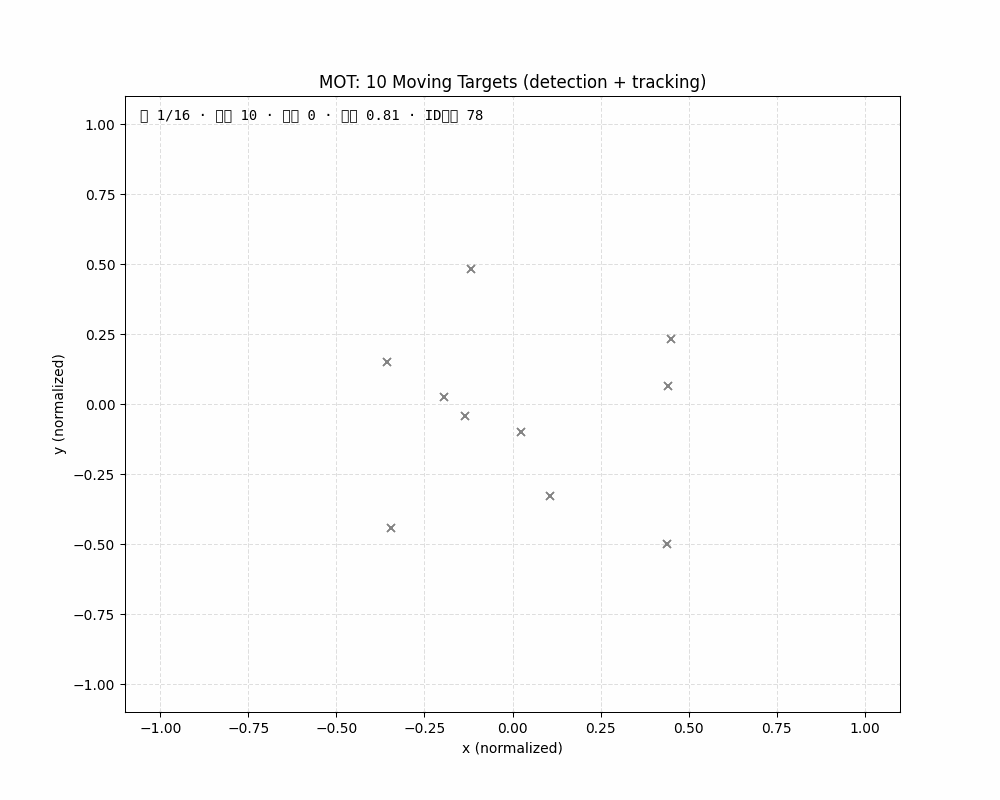
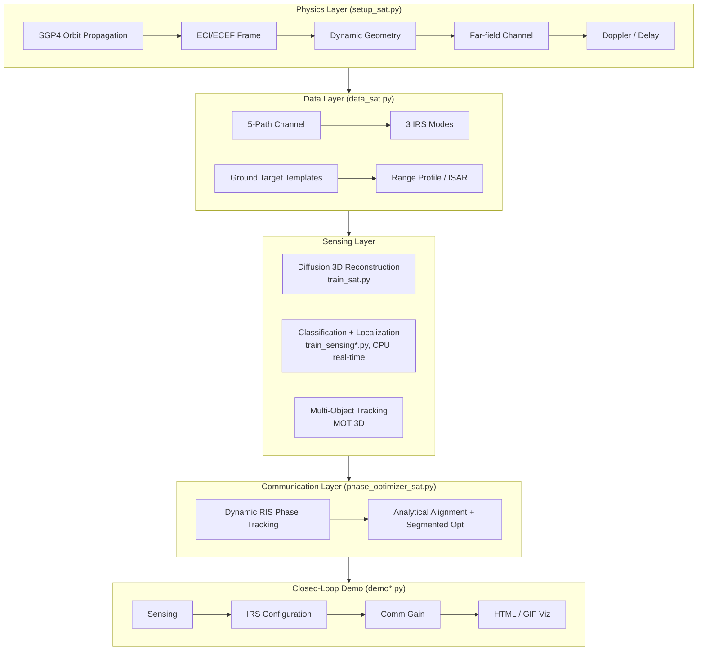
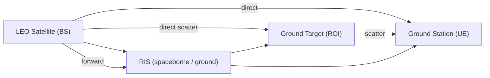

# 🛰️ IRS-Diffu-ISAC

**English** · [简体中文](README.zh-CN.md)

[](https://github.com/ConradLu2740/IRS-Diffu-ISAC/actions/workflows/ci.yml)
[](https://www.python.org/)
[](https://pytorch.org/)
[](LICENSE)
[](https://github.com/ConradLu2740/IRS-Diffu-ISAC/releases)
[](https://colab.research.google.com/github/ConradLu2740/IRS-Diffu-ISAC/blob/main/colab/isac_demo.ipynb)

**RIS-Aided Integrated Sensing and Communication (ISAC) — from Conditional Diffusion 3D Reconstruction to Space ISAC (ISAC-NTN) Engineering Loop**

Intelligent Reflecting Surface (RIS) aided **Integrated Sensing and Communication (ISAC)**, powered by Conditional Latent Diffusion Models for 3D point cloud reconstruction, and extended to **space-based ISAC**: real LEO satellite orbits (SGP4), dynamic RIS tracking, multi-target 3D tracking (MOT), SDR data interface, and an **end-to-end sensing–communication closed-loop demo**.

> 🎯 **A school research project turned engineering showcase** — physics-grounded, reproducible, and demo-ready.

---

## 🚀 60-Second Experience (Zero Setup)

[](https://colab.research.google.com/github/ConradLu2740/IRS-Diffu-ISAC/blob/main/colab/isac_demo.ipynb)

Click the badge to run in **Google Colab** — clone → install → real satellite orbit verification → sensing–communication closed-loop demo → animated GIF. No local environment needed.

Run locally? See [Quick Start](#-quick-start).

---

## ✨ Highlights

| | |
|---|---|
| 🛰️ **Real Orbit Simulation** | SGP4 propagation of real LEO satellites (ISS / Starlink TLE), dynamic geometry + Doppler + delay, physics-verified against real values |
| 📡 **Dynamic RIS Phase Tracking** | Analytical phase alignment, frame-by-frame tracking power **+283%**; segmented tracking quantifies the "RIS reconfiguration rate vs channel coherence time" trade-off |
| 🎯 **Sensing–Communication Closed-Loop** | Sense targets from communication signals (classification + localization) → auto-configure IRS → communication power **+233%** (98% of ideal oracle) |
| 🚁 **Multi-Object Tracking in 3D** | Simultaneously track **10 moving targets** (car / drone / bicycle / pedestrian / train) with **full 3D trajectories** — drones in the air, ground targets locked to the ground |
| 🖥️ **Interactive Demos** | Single-file HTML players (scene switching / timeline / real UTC overpass time) + GIF animations, shareable with a double-click |
| 📻 **SDR Interface** | IQ data format + ingest pipeline (time-domain IQ → FFT → range profile, fidelity 0.998), hardware-ready (RTL-SDR / USRP) |
| 🧪 **Reproducible Verification** | Physics checks, tracking trade-offs, multi-target sensing, multi-orbit / Ka-band robustness — all one-command scripts |

---

## 🎬 Demos

### 1. Sensing–Communication Closed-Loop
Satellite overpass → sense the target → IRS auto-pointing → communication power boost.


- 🖥️ Interactive (multi-scene): [`demo_live.html`](source_code/isac_sat/isac_demo/demo_live.html)
- 🎬 Generate: `python demo_live.py` / `python make_animation.py`

### 2. Multi-Object Tracking in 3D (MOT)
10 moving targets of 5 types — **drones fly in the air, ground targets stay locked to the ground** (z-constrained).



- 🖥️ Interactive 3D (rotate / zoom / hover): [`mot_3d.html`](source_code/isac_sat/isac_demo/mot_3d.html) — **open this file and see the full 3D scene!**
- 🎬 Generate: `python demo_mot_html.py`

---

## 📊 Key Results

| Experiment | Result |
|------------|--------|
| Orbit physics verification (ISS) | Altitude 418 km / velocity 7.66 km/s / period 92.9 min (matches real values) |
| Overpass Doppler (30 GHz) | −610 ~ +610 kHz (S-curve, real LEO order of magnitude) |
| RIS dynamic tracking | Frame-by-frame power **+283%**; K=8 segmented (reconfiguration-limited) gain vanishes |
| Wideband HRRP classification | **0.867** (narrowband 0.383 → wideband 0.867 → ISAR sequence 0.933) |
| Sensing–comm closed-loop (single) | Classification 83%, comm gain **+233%** (98% of oracle) |
| Sensing–comm closed-loop (multi) | Detection 2/2, IRS pointing gain **+289%** (94% of oracle) |
| Multi-target tracking (MOT) | 10 targets / 5 classes, detection recall 81%, trajectory aggregation boosts class accuracy |
| Multi-orbit / Ka-band | ISS / Starlink ×30 / 28 GHz all PASS, physics consistency verified |

> ⚠️ **Honest notes**: absolute attitude estimation is **not feasible** (physical upper bound) for far-field star–ground links with simple symmetric templates; single-station multi-target **classification** is limited by signal mixing (detection/localization works).

---

## 📊 Comparison with Related Open-Source Projects

**Feature coverage vs. representative open-source projects** in ISAC / RIS / diffusion-3D (checked Aug 2026):

| Capability | **IRS-Diffu-ISAC** | [5G ISAC Sys-Level](https://github.com/xds0112/5G_based_System_level_Integrated_Sensing_and_Communication_Simulator) | [ISAC-PLM (802.11ay)](https://github.com/wigig-tools/isac-plm) | [PassiveDOA-ISAC-RIS](https://github.com/chenpengseu/PassiveDOA-ISAC-RIS) | [Diffusion 3D (PVD)](https://github.com/luost26/diffusion-point-cloud) |
|---|---|---|---|---|---|
| Scenario | **Space ISAC (LEO/NTN)** | 5G NR cellular | 60 GHz WiGig | Ground RIS sensing | Generic 3D point cloud |
| Language / Stack | **Python · PyTorch** | MATLAB | MATLAB | MATLAB | PyTorch |
| RIS modeling | ✅ **dynamic phase tracking** | ❌ | ❌ | ✅ passive DOA | ❌ |
| Diffusion 3D reconstruction | ✅ **conditional LDM** | ❌ | ❌ | ❌ | ✅ |
| Sensing–communication closed loop | ✅ **end-to-end demo** | ⚠️ framework | ⚠️ PHY-level | ❌ | ❌ |
| Real LEO orbit (SGP4) | ✅ | ❌ | ❌ | ❌ | ❌ |
| Multi-object 3D tracking | ✅ | ❌ | ❌ | ❌ | ❌ |
| SDR data interface | ✅ | ❌ | ⚠️ | ❌ | ❌ |
| Reproducible physics verification | ✅ (CI) | ✅ | ✅ | ⚠️ | ✅ |
| Instant demo (Colab / HTML / GIF) | ✅ | ❌ | ⚠️ | ❌ | ✅ |

> ⚠️ **Fairness note**: each project runs its own simulation setup, so absolute metric values are **not directly comparable across rows** — the table above compares *feature coverage and engineering depth*, not benchmark scores.

**Reported metrics** (each project's own setting, for reference only):

| Project | Reported metrics |
|---|---|
| **IRS-Diffu-ISAC** | HRRP classification **0.867** · closed-loop comm gain **+233%** (98% of oracle) · RIS tracking **+283%** · MOT recall **0.812** (10 targets / 5 classes) · 3D reconstruction CD 0.137–0.183 (space ISAC; vs 0.233 without RIS) |
| PVD (ShapeNet) | CD ~1.5e-3 on ShapeNet — standard *generation* benchmark, different task (unconditional 3D generation, no channel/ISAC physics) |
| ISAC-PLM | Link-level sensing MSE / NMSE for 60 GHz 802.11ay (short-range PHY layer) |
| 5G ISAC System-Level | 5G NR system-level simulation (sensing via 2D-CFAR / MUSIC, cellular scenario) |

---

## 🧭 Architecture



**Signal model** (5 propagation paths):



---

## 🚀 Quick Start

```bash
# Environment
python3 -m venv .venv
.venv/bin/pip install -r requirements.txt

cd source_code/isac_sat

# 1. Physics verification (orbit / Doppler / channel, ~1 min)
../../.venv/bin/python verify_sat.py

# 2. One-shot closed-loop demo (auto-train sensing + run loop)
bash run_demo.sh

# 3. Live demos (HTML player + GIF animation)
../../.venv/bin/python demo_live.py --n_scenes 3
../../.venv/bin/python make_animation.py

# 4. Multi-target sensing closed-loop
../../.venv/bin/python train_sensing_multi.py --wideband
../../.venv/bin/python demo_multi.py

# 5. RIS dynamic tracking trade-off
../../.venv/bin/python verify_tracking.py

# 6. SDR data pipeline (no hardware: simulated IQ → playback sensing)
../../.venv/bin/python demo_sdr.py

# 7. Multi-object tracking (10 moving targets, detect + track + animate)
../../.venv/bin/python train_detect.py --n_scenes 25 --epochs 50
../../.venv/bin/python demo_mot.py
../../.venv/bin/python demo_mot_html.py   # interactive 3D HTML
```

---

## 🗺️ Roadmap

- [x] LEO satellite dynamic simulation (SGP4 real TLE, Doppler, delay)
- [x] Dynamic RIS phase tracking + reconfiguration-rate trade-off
- [x] Sensing–communication closed loop (single / multi-target)
- [x] Wideband HRRP / ISAR sequence sensing
- [x] 3D multi-object tracking (10 targets, 5 classes)
- [x] SDR IQ data interface + ingest pipeline
- [x] Colab one-click experience + CI + GitHub promotion
- [ ] **GEO / MEO orbit support** (currently LEO-focused)
- [ ] **Real SDR over-the-air capture** (RTL-SDR / USRP backend)
- [ ] **Space debris / satellite geometry targets** (replace simple templates)
- [ ] **On-board computational constraints**: model distillation / quantization
- [ ] **Low-SNR robustness** evaluation suite

---

## 📁 Project Structure

```
IRS-Diffu-ISAC/
├── source_code/
│   ├── isac_sat/                      # Space-ground ISAC + sensing + demo (active)
│   │   ├── setup_sat.py / data_sat.py / train_sat.py / eval_sat.py
│   │   ├── phase_optimizer_sat.py / task_sat.py
│   │   ├── train_sensing*.py          # Sensing (classification + localization)
│   │   ├── mot_data.py / mot_tracker.py / train_detect.py / demo_mot*.py  # 3D MOT
│   │   ├── sdr_io.py / sdr_ingest.py  # SDR data interface (IQ / ingest)
│   │   ├── demo*.py / make_animation.py / run_demo.sh
│   │   └── isac_demo/                 # checkpoints + HTML players + GIFs
│   ├── legacy/                        # Original project (RIS + diffusion 3D recon, archived)
│   └── requirements.txt
├── colab/                             # One-click Colab notebook
├── archive/
│   ├── source_code.zip                # Historical snapshot
│   └── original-docs/                 # Original project docs (architecture.md / Code_Wiki.md / figures)
├── space_isac_design.md               # Full design document (physics, results, pitfalls)
├── CONTRIBUTING.md
├── README.md / README.zh-CN.md
└── LICENSE
```

---

## 📚 Documentation

- **[space_isac_design.md](space_isac_design.md)** — complete design: physical model, experiments, physical conclusions, pitfalls
- Original project docs (archived): [`archive/original-docs/`](archive/original-docs/) — [`architecture.md`](archive/original-docs/architecture.md) / [`Code_Wiki.md`](archive/original-docs/Code_Wiki.md)
- **[CONTRIBUTING.md](CONTRIBUTING.md)** — how to contribute

## Tech Stack

`Python · PyTorch · SGP4 · NumPy/SciPy · Matplotlib · scikit-learn`

## 🤝 Contributing

Found a bug? Have an idea? Check out [CONTRIBUTING.md](CONTRIBUTING.md) and open an [issue](https://github.com/ConradLu2740/IRS-Diffu-ISAC/issues) or [PR](https://github.com/ConradLu2740/IRS-Diffu-ISAC/pulls). All contributions welcome!

**If this project is useful for your research or engineering, give it a ⭐ — it helps more people find it!**

## Citation

If you use this project in your research:

```bibtex
@misc{irsdiffuisac2026,
  title  = {IRS-Diffu-ISAC: RIS-Aided ISAC via Diffusion Models for 3D Point Cloud Reconstruction},
  author = {Lu, Conrad},
  year   = {2026},
  howpublished = {\url{https://github.com/ConradLu2740/IRS-Diffu-ISAC}}
}
```

## License

[MIT](LICENSE) © 2026 Conrad Lu
