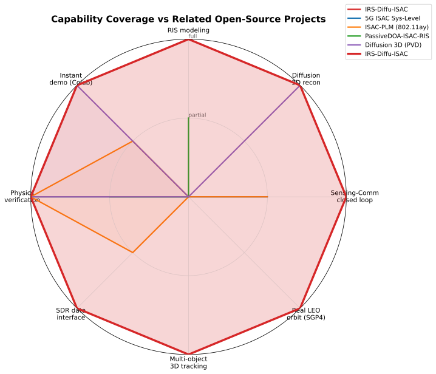
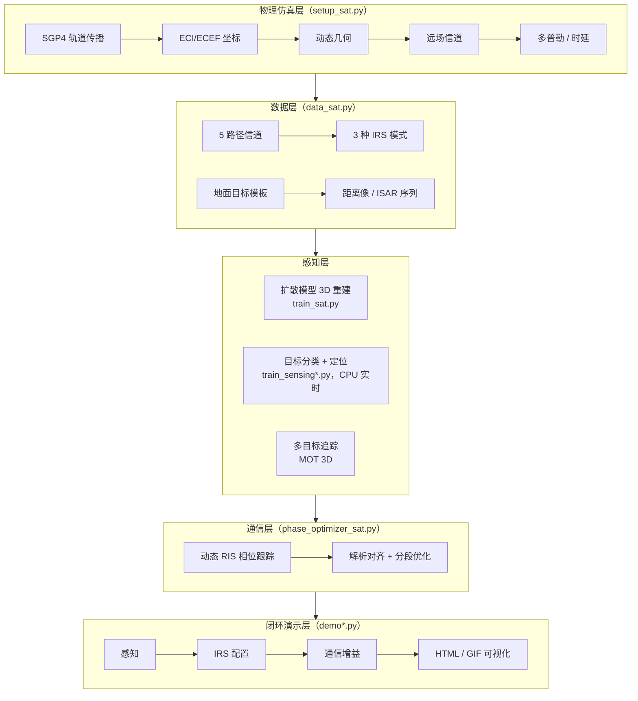
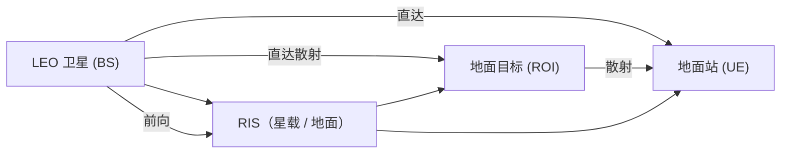

# 🛰️ IRS-Diffu-ISAC

[English](README.md) · **简体中文**

[](https://github.com/ConradLu2740/IRS-Diffu-ISAC/actions/workflows/ci.yml)
[](https://www.python.org/)
[](https://pytorch.org/)
[](LICENSE)
[](https://github.com/ConradLu2740/IRS-Diffu-ISAC/releases)
[](https://colab.research.google.com/github/ConradLu2740/IRS-Diffu-ISAC/blob/main/colab/isac_demo.ipynb)

**RIS 辅助通感一体化（ISAC）· 从扩散模型 3D 重建到太空 ISAC（ISAC-NTN）工程闭环**

Intelligent Reflecting Surface (RIS) aided **Integrated Sensing and Communication (ISAC)** — 基于条件潜在扩散模型的 3D 点云重建，扩展至**天基 ISAC**：真实 LEO 卫星轨道（SGP4）、动态 RIS 跟踪、多目标 3D 追踪（MOT）、SDR 数据接口，以及**端到端感知-通信闭环演示**。

> 🎯 **学校科研项目 × 工程化展示** —— 物理可验证、结果可复现、演示即所得。

---

## 🧭 同行速览（TL;DR）

**这是什么** — 一个开源、物理可验证的 **RIS 辅助 ISAC 参考实现**：
真实 LEO 轨道（SGP4）→ 动态 RIS 相位跟踪 → 通信信号感知 → 闭环演示。
全部数据与权重**由程序内合成生成** —— clone 后 `make setup` 即可，**无需下载任何数据集**。

**你可以用它做什么**
- **复现**核心结论（RIS 跟踪 **+89%**、闭环通信增益 **+309%**），几分钟内跑通
- **扩展**：换卫星 / 换频段 / 换目标模板 / 换成自己的模型
- **对比**经典基线（2D-CFAR + MUSIC，`make baseline`）

**最快路径**
```bash
make setup    # 约 2-3 分钟，仅首次
make verify   # 1 分钟物理自检（ALL PASS）
make demo     # 自动训练 + 感知-通信闭环
```

命令地图：`make help` · 脚本逐一使用卡片：[`source_code/isac_sat/README.md`](source_code/isac_sat/README.md) · 参数配方：[`configs/README.md`](configs/README.md)

---

## 🚀 60 秒体验（零配置）

[](https://colab.research.google.com/github/ConradLu2740/IRS-Diffu-ISAC/blob/main/colab/isac_demo.ipynb)

点击上方按钮在 **Google Colab** 一键体验：克隆仓库 → 装依赖 → 真实卫星轨道验证 → 感知-通信闭环 demo → 生成演示 GIF。无需本地环境。

本地运行见 [快速开始](#-快速开始)。

---

## ✨ 核心亮点

| | |
|---|---|
| 🛰️ **真实轨道仿真** | SGP4 传播真实 LEO 卫星（ISS / Starlink TLE），动态几何 + 多普勒 + 时延，与真实物理值吻合 |
| 📡 **RIS 动态相位跟踪** | 解析相位对齐，逐帧跟踪功率 **+89%**（K=1）；分段跟踪（K=2/4/8）量化"RIS 重构速率 vs 信道相干时间"权衡——K=8 增益消失（甚至为负） |
| 🎯 **感知-通信闭环** | 通信信号感知目标（分类 + 定位）→ 自动配置 IRS → 通信功率 **+309%**（达成理想优化 97.6%） |
| 🚁 **3D 多目标追踪** | 同时追踪 **10 个移动目标**（轿车 / 无人机 / 自行车 / 行人 / 火车 5 类），**完整 3D 轨迹**——无人机天上飞、地面目标贴地锁死 |
| 🖥️ **交互式演示** | 单文件 HTML 播放器（场景切换 / 时间轴 / UTC 真实过境时间）+ GIF 动画，双击即开可分享 |
| 📻 **SDR 接口** | IQ 数据格式 + 导入管线（时域 IQ → FFT → 距离像，保真 0.998），硬件预留（RTL-SDR / USRP） |
| 🧪 **可复现验证** | 物理验证、跟踪权衡、多目标感知、多轨道 / Ka 频段鲁棒性——全部脚本一键运行 |

---

## 🎬 演示

### 1. 感知-通信闭环
卫星过境 → 感知目标 → IRS 自动指向 → 通信质量提升。


- 🖥️ 交互版（多场景切换）：[`demo_live.html`](source_code/isac_sat/isac_demo/demo_live.html)
- 🎬 生成：`python demo_live.py` / `python make_animation.py`

### 2. 3D 多目标追踪（MOT）
10 个移动目标、5 种类型——**无人机在空中飞，地面目标 z 坐标锁定贴地**。


- 🖥️ **交互式 3D**（旋转 / 缩放 / 悬停查看）：[`mot_3d.html`](source_code/isac_sat/isac_demo/mot_3d.html) —— 双击打开，看完整 3D 场景！
- 🎬 生成：`python demo_mot_html.py`

---

## 📊 关键结果

| 实验 | 结果 |
|------|------|
| 轨道物理验证（ISS） | 高度 418 km / 速度 7.66 km/s / 周期 92.9 min（与真实值吻合） |
| 过境多普勒（30 GHz） | −610 ~ +610 kHz（S 型曲线，真实 LEO 量级） |
| RIS 动态跟踪 | 逐帧跟踪功率 **+89%**（K=1）；K=8 分段（重构受限）增益消失（−42%，甚至有害） |
| 宽带 HRRP 目标分类 | **0.80**（5 类模板；早期 6 类实验：0.383 → 0.867 → ISAR 0.933） |
| 感知-通信闭环（单目标） | 分类 80%，通信增益 **+309%**（oracle 达成率 97.6%） |
| 感知-通信闭环（多目标） | 检测 1/2，IRS 指向增益 **+444%**（oracle 达成率 93%） |
| 多目标追踪（MOT） | 10 目标 / 5 类，检测召回 **0.60**，轨迹类别准确率 0.73 |
| 经典基线（2D-CFAR） | 检测率 **100%**（P_fa=1e-4），沿视线定位 RMSE **8.1 m**——无需训练 |
| 经典基线（MUSIC） | ULA-8 目标方向测向 MAE **0.017°**（合成快照）；远场角度分辨对 ROI 内定位物理不足 |
| ML vs 经典（公平） | ML（绝对距离特征）沿视线 RMSE **2.3 m** vs CFAR 8.1 m；相对质心特征 = 仅类别先验（2D RMSE 22.6 m）；特征缺陷已修复（`center='roi'`） |
| 多轨道 / Ka 频段 | ISS / Starlink ×30 / 28 GHz 全 PASS，物理一致性验证 |

> ⚠️ **诚实标注**：星-地远场 + 简单对称模板下，**绝对姿态估计不可行**（物理上界）；单站多目标**分类**受信号混合限制（检测/定位可用）。

---

## 📊 同类开源项目对比



*8 维度能力覆盖（满分 2/2）。雷达图源码：[`assets/make_comparison_radar.py`](assets/make_comparison_radar.py)。*

**功能覆盖对比**（与 ISAC / RIS / 扩散 3D 方向的代表性开源项目，2026-08 核实）：

| 能力 | **IRS-Diffu-ISAC** | [5G ISAC 系统级仿真](https://github.com/xds0112/5G_based_System_level_Integrated_Sensing_and_Communication_Simulator) | [ISAC-PLM (802.11ay)](https://github.com/wigig-tools/isac-plm) | [PassiveDOA-ISAC-RIS](https://github.com/chenpengseu/PassiveDOA-ISAC-RIS) | [扩散 3D (PVD)](https://github.com/luost26/diffusion-point-cloud) |
|---|---|---|---|---|---|
| 场景 | **太空 ISAC（LEO/NTN）** | 地面 5G NR | 60 GHz WiGig | 地面 RIS 感知 | 通用 3D 点云 |
| 语言 / 技术栈 | **Python · PyTorch** | MATLAB | MATLAB | MATLAB | PyTorch |
| RIS 建模 | ✅ **动态相位跟踪** | ❌ | ❌ | ✅ 被动 DOA | ❌ |
| 扩散模型 3D 重建 | ✅ **条件潜扩散 LDM** | ❌ | ❌ | ❌ | ✅ |
| 感知-通信闭环 | ✅ **端到端演示** | ⚠️ 框架 | ⚠️ PHY 层 | ❌ | ❌ |
| 真实 LEO 轨道（SGP4） | ✅ | ❌ | ❌ | ❌ | ❌ |
| 多目标 3D 追踪 | ✅ | ❌ | ❌ | ❌ | ❌ |
| SDR 数据接口 | ✅ | ❌ | ⚠️ | ❌ | ❌ |
| 可复现物理验证 | ✅（CI） | ✅ | ✅ | ⚠️ | ✅ |
| 即开即用演示（Colab / HTML / GIF） | ✅ | ❌ | ⚠️ | ❌ | ✅ |

> ⚠️ **公平性说明**：各项目仿真设置不同，**指标绝对值不可跨行直接比较**——上表对比的是*功能覆盖与工程深度*，而非基准分数。

**各项目公开指标**（各自设置下，仅供参考）：

| 项目 | 公开指标 |
|---|---|
| **IRS-Diffu-ISAC** | 宽带 HRRP 分类 **0.80**（5 类）· 闭环通信增益 **+309%**（oracle 97.6%）· RIS 跟踪 **+89%**（K=1）· MOT 召回 **0.60**（10 目标 / 5 类）· 2D-CFAR 检测 100%、LOS RMSE 8.1 m · 3D 重建 CD 0.137–0.183（无 RIS 时 0.233） |
| PVD（ShapeNet） | CD ~1.5e-3 @ShapeNet——标准*生成*基准，任务不同（无条件 3D 生成，无信道/ISAC 物理） |
| ISAC-PLM | 60 GHz 802.11ay 链路级感知 MSE / NMSE（短距 PHY 层） |
| 5G ISAC 系统级 | 5G NR 系统级仿真（2D-CFAR / MUSIC 感知，蜂窝场景） |

---

## 🧭 架构



**信号模型**（5 条传播路径）：



---

## 🚀 快速开始

> 💡 所有命令通过 [`Makefile`](Makefile) 一键执行 —— **数据与权重程序内生成，无需下载。**

```bash
# 1. 环境（仅首次，约 2-3 分钟）
make setup

# 2. 物理自检：轨道 / 多普勒 / 信道（约 1 分钟）
make verify

# 3. 感知-通信闭环 demo（自动训练感知模型）
make demo

# 4. 更多
make help               # 全部命令地图
make demo-live          # 交互式多场景 HTML 播放器
make demo-anim          # GIF 动画
make demo-multi         # 多目标感知闭环
make track              # RIS 动态跟踪权衡
make sdr                # SDR 管线演示（无需硬件）
make mot                # 10 目标 3D MOT（训练+跟踪+HTML）
make baseline           # 经典基线对比（2D-CFAR + MUSIC）
```

不用 `make` 的手动等价命令：
```bash
python3 -m venv .venv
.venv/bin/pip install -r requirements.txt
cd source_code/isac_sat
../../.venv/bin/python verify_sat.py          # 1. 物理验证
bash run_demo.sh                              # 2. 闭环 demo（自动训练）
../../.venv/bin/python demo_live.py --n_scenes 3
../../.venv/bin/python make_animation.py      # 3. 实时演示
../../.venv/bin/python train_sensing_multi.py --wideband && ../../.venv/bin/python demo_multi.py
../../.venv/bin/python verify_tracking.py     # 4. RIS 跟踪权衡
../../.venv/bin/python demo_sdr.py            # 5. SDR 管线
../../.venv/bin/python train_detect.py --n_scenes 25 --epochs 50 && ../../.venv/bin/python demo_mot.py && ../../.venv/bin/python demo_mot_html.py
```

每个脚本的用途 / 产物卡片：[`source_code/isac_sat/README.md`](source_code/isac_sat/README.md)

---

## 🔧 如何改造成自己的场景

| 想改什么 | 改哪里 | 说明 |
|---|---|---|
| 换卫星 / 轨道 | `source_code/isac_sat/setup_sat.py`（TLE 常量） | 内置 ISS（25544）与 Starlink（44714），可用任意 NORAD ID 替换 |
| 换频段 | `setup_sat.py` 的 `FC_HZ` | 默认 30 GHz 毫米波；Ka 频段验证见 `verify_robustness.py` |
| 换目标模板 | `data_sat.py` 的 `_template_*()` | car / uav / building / tank / tower / cubesat / bicycle / pedestrian / train |
| 换成自己的模型 | 训练脚本中的 `nn.Module` | 输入维度见 `channels.frame_cond_dim()` |
| 改天线阵列 | `--bs_ant` / `--ue_ant` | 命令行即可，无需改代码 |

实验配方与参数速查：[`configs/README.md`](configs/README.md)

---

## 🗺️ 路线图

- [x] LEO 卫星动态仿真（SGP4 真实 TLE，多普勒、时延）
- [x] 动态 RIS 相位跟踪 + 重构速率权衡
- [x] 感知-通信闭环（单目标 / 多目标）
- [x] 宽带 HRRP / ISAR 序列感知
- [x] 3D 多目标追踪（10 目标 / 5 类）
- [x] SDR IQ 数据接口 + 导入管线
- [x] Colab 一键体验 + CI + GitHub 推广
- [ ] **GEO / MEO 轨道支持**（当前以 LEO 为主）
- [ ] **真实 SDR 空口采集**（RTL-SDR / USRP 后端）
- [ ] **太空碎片 / 卫星几何目标**（替换简单模板）
- [ ] **星载计算约束**：模型蒸馏 / 量化
- [ ] **低 SNR 鲁棒性**评估套件

---

## 📁 项目结构

```
IRS-Diffu-ISAC/
├── Makefile                        # 🆕 一键命令入口：make setup / verify / demo / ...
├── pyproject.toml                  # 🆕 元数据 + 依赖声明
├── configs/                        # 🆕 参数速查 + 实验配方
│   └── README.md
├── requirements.txt
├── source_code/
│   ├── isac_sat/                   # 星-地 ISAC + 感知 + demo（活跃工作区）
│   │   ├── README.md               # 🆕 脚本逐一使用卡片（用途 / 命令 / 产物）
│   │   ├── setup_sat.py / data_sat.py / train_sat.py / eval_sat.py
│   │   ├── phase_optimizer_sat.py / task_sat.py
│   │   ├── train_sensing*.py          # 感知（分类+定位）
│   │   ├── mot_data.py / mot_tracker.py / train_detect.py / demo_mot*.py  # 3D MOT
│   │   ├── sdr_io.py / sdr_ingest.py  # SDR 数据接口（IQ / 导入）
│   │   ├── demo*.py / make_animation.py / run_demo.sh
│   │   └── isac_demo/                 # checkpoint + HTML 播放器 + GIF
│   └── legacy/                        # 原项目（RIS + 扩散模型 3D 重建，归档）
├── colab/                             # 一键 Colab 笔记本
├── archive/
│   ├── source_code.zip                # 历史快照
│   └── original-docs/                 # 原项目文档（architecture.md / Code_Wiki.md / 图）
├── space_isac_design.md               # 完整设计文档（物理、结果、踩坑）
├── CONTRIBUTING.md
├── README.md / README.zh-CN.md
└── LICENSE
```

> 🆕 `legacy/` 与 `archive/` 为**历史归档** —— 新工作请前往 `source_code/isac_sat/`。

---

## 📚 文档

- **[TECH_REPORT.md](TECH_REPORT.md)** — arXiv 版技术报告：系统模型、闭环结果、经典基线（2D-CFAR + MUSIC）、物理发现
- **[space_isac_design.md](space_isac_design.md)** — 完整设计：物理模型、实验结果、物理结论、踩坑记录
- 原项目文档（已归档）：[`archive/original-docs/`](archive/original-docs/) — [`architecture.md`](archive/original-docs/architecture.md) / [`Code_Wiki.md`](archive/original-docs/Code_Wiki.md)
- **[CONTRIBUTING.md](CONTRIBUTING.md)** — 贡献指南

## 技术栈

`Python · PyTorch · SGP4 · NumPy/SciPy · Matplotlib · scikit-learn`

## 🤝 参与贡献

发现 bug？有想法？查看 [CONTRIBUTING.md](CONTRIBUTING.md) 并提交 [Issue](https://github.com/ConradLu2740/IRS-Diffu-ISAC/issues) 或 [PR](https://github.com/ConradLu2740/IRS-Diffu-ISAC/pulls)，欢迎一切贡献！

**如果这个项目对你的科研或工程有帮助，点个 ⭐ —— 让更多人看到它！**

## 引用

```bibtex
@misc{irsdiffuisac2026,
  title  = {IRS-Diffu-ISAC: RIS-Aided ISAC via Diffusion Models for 3D Point Cloud Reconstruction},
  author = {Lu, Conrad},
  year   = {2026},
  howpublished = {\url{https://github.com/ConradLu2740/IRS-Diffu-ISAC}}
}
```

## License

[MIT](LICENSE) © 2026 Conrad Lu
