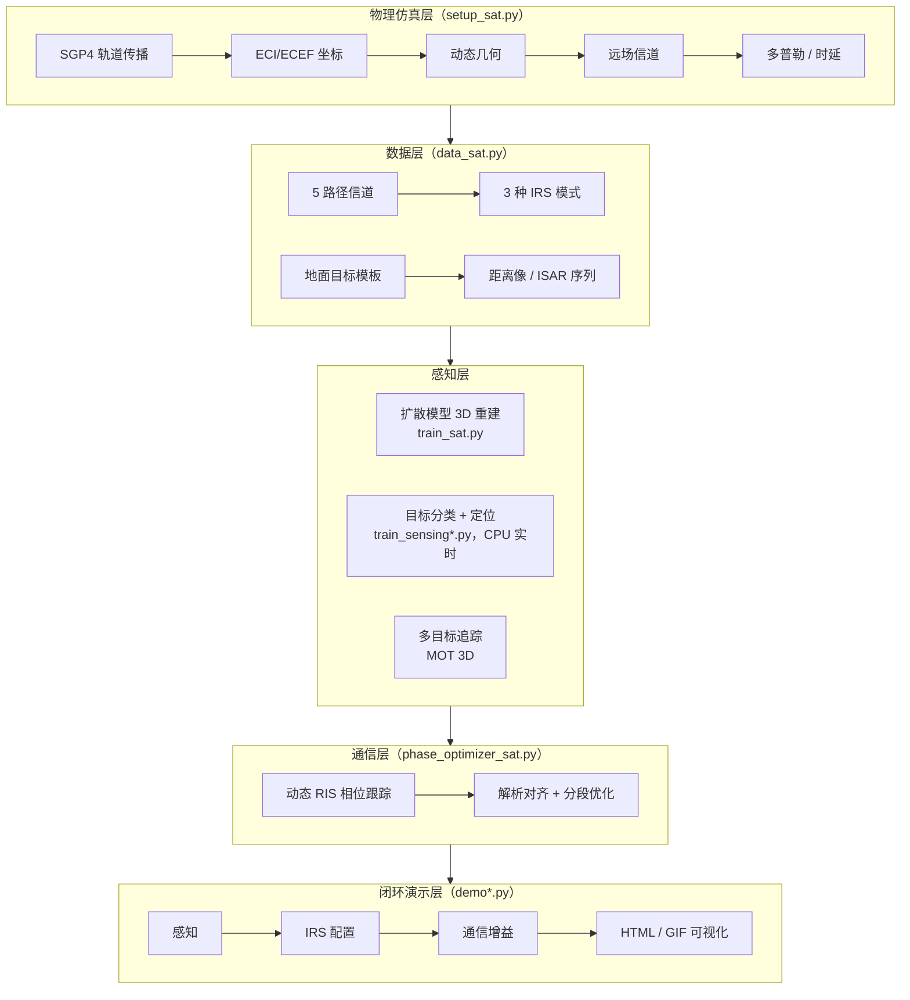
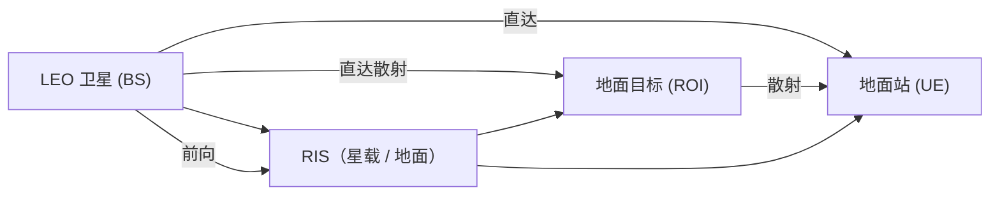

# 🛰️ IRS-Diffu-ISAC

[English](README.md) · **简体中文**

[](https://github.com/ConradLu2740/IRS-Diffu-ISAC/actions/workflows/ci.yml)
[](https://www.python.org/)
[](https://pytorch.org/)
[](LICENSE)
[](https://github.com/ConradLu2740/IRS-Diffu-ISAC/releases)
[](https://colab.research.google.com/github/ConradLu2740/IRS-Diffu-ISAC/blob/main/colab/isac_demo.ipynb)

**一个带证书的 RIS 辅助星地 ISAC 试验台 —— 每条结论都附带它的证明、它的界、或它对公众的证伪。**

真实 LEO 轨道（SGP4）· 动态 RIS 相位优化 · 扩散与 Flow Matching 生成式感知 · 感知-通信闭环 · 直面真实 ±611 kHz 多普勒的 OTFS/AFDM · 以及一套验证体系：每个头条数字要么**被证书认证**、要么**被双侧区间夹逼**、要么**被公开证伪**。

> 🎯 **从学校科研项目长成的可证伪试验台** —— 物理可验证、结果可复现、演示即所得，并且诚实记录哪些结论**不**成立（见下方**墙地图**一节）。

---

## 🎯 核心主张

大多数 ISAC 论文只报告数字，不报告数字**成立的条件**。本仓库采取相反的契约：**先注册命题，再验证它——包括验证说"不"的时候。**

| | |
|---|---|
| 🔬 **19 个验证脚本** | 轨道物理、RIS SDR 最优性括号、ODE 收敛阶、Lipschitz 常数、CRB 底噪、Pareto 前沿、DP 调度证书、信息阶梯——全部固定种子、JSON 落盘、PASS/FAIL 判定 |
| 📉 **10+ 个被证伪的预测** | SDR 收益被高估一个数量级；Hessian 加权方向死亡（值函数是阶梯函数）；free-bits 死亡（无后验坍缩）；临界 SNR −8 dB → 实测 −31.2 dB；"OFDM SIR ≤ 5 dB" → 11.7 dB；等 NFE 下 FM 优势非单调——全部记录，无一隐藏 |
| 🧱 **墙地图** | 四种独立方法（信息论、功率核算、全局优化、估计理论）给出同一指引：这个场景的下一步在**标定与几何**，不在 RIS 相位算法 |

**一句话头条**：同等质量下 Flow Matching 比扩散少用 **50–100× 网络评估**（1–10 步 ODE vs 100 步祖先采样；Euler 阶 −0.87、轨迹直 176×、crossover NFE≤2）——3 种子配对 A/B 显示两者质量**统计不可分辨**，剩余距 VAE 天花板 15–20× 的差距定位在 VAE/训练规模而非生成目标函数。闭环可证达到**认证全局最优的 ≈69%**（CI [0.638, 0.745]；FM 形状先验后 ≈74%）。

---

## 🧭 同行速览（TL;DR）

**这是什么** — 一个开源、物理可验证的 **RIS 辅助 ISAC 参考实现**：
真实 LEO 轨道（SGP4）→ 动态 RIS 相位跟踪 → 通信信号感知 → 闭环演示。
全部数据与权重**由程序内合成生成** —— clone 后 `make setup` 即可，**无需下载任何数据集**。

**你可以用它做什么**
- **复现**核心结论（RIS 跟踪 **+173%**、闭环通信增益 **+374%**；v1.7 物理一致性审计后数字，见 `docs/physics_audit_table.md`），几分钟内跑通
- **扩展**：换卫星 / 换频段 / 换目标模板 / 换成自己的模型
- **对比**经典基线（2D-CFAR + MUSIC，`make baseline`）或生成式强 baseline（DDIM 少步、渐进蒸馏，`make verify-baselines`）

**最快路径**
```bash
make setup    # 约 2-3 分钟，仅首次
make verify   # 1 分钟物理自检（ALL PASS）
make demo     # 自动训练 + 感知-通信闭环
```

命令地图：`make help` · 脚本逐一使用卡片：[`source_code/isac_sat/README.md`](source_code/isac_sat/README.md) · 参数配方：[`configs/README.md`](configs/README.md) · 优化路线图与预注册命题：[`docs/optimization_roadmap.md`](docs/optimization_roadmap.md)

---

## 🧱 全流程仿真参考库（`isac_sim/`，新）

在上方星-地演示之外，本仓库正在成长为 **ISAC 全流程的分层可插拔仿真参考库**——每一层都可替换、可单独复用：

```text
isac_sim/
├── channels/     # L0 自由空间（默认）→ L1 莱斯衰落（K 因子，功率对齐）→ L2 3GPP TR 38.811 NTN（规划）
├── waveforms/    # OFDM 感知波形（默认）→ OTFS / AFDM（已实现，ICI 恒等式验证）
├── ris/          # 连续相位（默认）· 1-bit 离散 · 分段重构（K-sweep，与模型解耦）
├── comm/         # QPSK over AWGN 最小链路（实测 BER 对照理论）
├── sensing/      # 一维 CA-CFAR（向量化）· 2D-CFAR/MUSIC/ML 适配器（规划）
├── tracking/     # 最近邻 + 匀速最小跟踪器（匈牙利 MOT 见 isac_sat）
├── findings/     # 带解析界的负结果：远场角度墙（含所需孔径公式）
└── stacks/       # 跨栈验证计划：Sionna 交叉验证 + MATLAB 参考实现
```

**设计铁律**：核心仅依赖 numpy（经典层无需 torch）· 每个模块入 main 前必须有物理 sanity check + 一条 make 命令 + CI 冒烟 · `source_code/isac_sat` 保持为参考应用。

运行分层冒烟套件（秒级，CPU）：
```bash
make smoke-sim
```

---

## 🚀 60 秒体验（零配置）

[](https://colab.research.google.com/github/ConradLu2740/IRS-Diffu-ISAC/blob/main/colab/isac_demo.ipynb)

点击上方按钮在 **Google Colab** 一键体验：克隆仓库 → 装依赖 → 真实卫星轨道验证 → 感知-通信闭环 demo → 生成演示 GIF。无需本地环境。

本地运行见 [快速开始](#-快速开始)。

---

## ✨ 核心亮点

| | |
|---|---|
| 🛰️ **真实轨道仿真** | SGP4 传播真实 LEO 卫星（ISS / Starlink TLE），动态几何 + 多普勒 + 时延，与真实物理值吻合 |
| 📡 **RIS 动态相位跟踪** | 全模型闭式相位对齐（含直达 + 两条 RIS 路径），逐帧跟踪功率 **+173%**（K=1；坐标上升可达值 +256%——注意它是全局最优的**下界**，认证设计因子区间 [0.73, 0.83]，见 TECH_REPORT v1.11 §6.7）；分段跟踪（K=2/4/8）量化"RIS 重构速率 vs 信道相干时间"权衡——K=8 增益大幅缩水 |
| 🎯 **感知-通信闭环** | 通信信号感知目标（分类 + 定位）→ 自动配置 IRS → 通信功率 **+374%**（达成理想闭环 73.3%） |
| 🚁 **3D 多目标追踪** | 同时追踪 **10 个移动目标**（轿车 / 无人机 / 自行车 / 行人 / 火车 5 类），**完整 3D 轨迹**——无人机天上飞、地面目标贴地锁死 |
| 🖥️ **交互式演示** | 单文件 HTML 播放器（场景切换 / 时间轴 / UTC 真实过境时间）+ GIF 动画，双击即开可分享 |
| 📻 **SDR 接口** | IQ 数据格式 + 导入管线（时域 IQ → FFT → 距离像，保真 0.998），硬件预留（RTL-SDR / USRP） |
| 🧪 **可复现验证** | 物理验证、跟踪权衡、多目标感知、多轨道 / Ka 频段鲁棒性——全部脚本一键运行 |

---

## 🎬 演示

### 1. 感知-通信闭环
卫星过境 → 感知目标 → IRS 自动指向 → 通信质量提升。


- 🖥️ 交互版（多场景切换）：[`demo_live.html`](source_code/isac_sat/isac_demo/demo_live.html)
- 🎬 生成：`python demo_live.py` / `python make_animation.py`

### 2. 3D 多目标追踪（MOT）
10 个移动目标、5 种类型——**无人机在空中飞，地面目标 z 坐标锁定贴地**。


- 🖥️ **交互式 3D**（旋转 / 缩放 / 悬停查看）：[`mot_3d.html`](source_code/isac_sat/isac_demo/mot_3d.html) —— 双击打开，看完整 3D 场景！
- 🎬 生成：`python demo_mot_html.py`

---

## 📊 关键结果

| 实验 | 结果 |
|------|------|
| 轨道物理验证（ISS） | 高度 418 km / 速度 7.66 km/s / 周期 92.9 min（与真实值吻合） |
| 过境多普勒（30 GHz） | −610 ~ +610 kHz（S 型曲线，真实 LEO 量级） |
| RIS 动态跟踪 | 逐帧跟踪功率 **+173%**（K=1，闭式全模型；数值上界 +256%）；K=8 分段 **+16%**（数值上界 −8%） |
| 宽带 HRRP 目标分类 | **0.80**（5 类模板；早期 6 类实验：0.383 → 0.867 → ISAR 0.933） |
| 感知-通信闭环（单目标） | 分类 80%，通信增益 **+374%**（理想闭环达成率 73.3%） |
| 感知-通信闭环（多目标） | 检测 0/2（单次场景），IRS 指向增益 **+577%**（理想闭环达成率 86%） |
| 多目标追踪（MOT） | 10 目标 / 5 类，检测召回 **0.60**，轨迹类别准确率 0.73 |
| DETR 化检测器（S1–S3） | DETR 风格头 + 校准 objectness：MOT 召回 **0.758** / RMSE **0.1860** vs 原始 0.699 / 0.2010（+8.4% / −7.5%）；objectness 优于 max-softmax（同召回下 F1 0.841 vs 0.727） |
| 经典基线（2D-CFAR） | 检测率 **100%**（P_fa=1e-4），沿视线定位 RMSE **8.1 m**——无需训练 |
| 经典基线（MUSIC） | ULA-8 目标方向测向 MAE **0.017°**（合成快照）；远场角度分辨对 ROI 内定位物理不足 |
| ML vs 经典（公平） | ML（绝对距离特征）沿视线 RMSE **2.3 m** vs CFAR 8.1 m；相对质心特征 = 仅类别先验（2D RMSE 22.6 m）；特征缺陷已修复（`center='roi'`） |
| 多轨道 / Ka 频段 | ISS / Starlink ×30 / 28 GHz 全 PASS，物理一致性验证 |
| DP 最优 RIS 重构 | 均匀 K 次优间隙 **40.1%（K=2）/ 42.1%（K=4）**精确值；穷举证书 0.00e+00；漂移非均匀比中位 9.26 |
| 感知-通信 Pareto 前沿（finding） | σ_cross(R) = 40.97/(2^R−1) 闭式（斜率 −1.0000，R²=1.0）；破墙 5.3 m ⇔ R≥3.13 bps/Hz；多帧融合 G(8)=6.95–8.15 |
| HRRP 信息底噪（finding） | 单散射体路径长 CRB **0.5165 mm**（MC/CRB=0.984）；文献假设 σ_ρ=0.15 m 保守 **290×** → 0.34 m 双站 RMSE 是模型受限，非信息受限 |
| Pilot FIM / η_est | genie-CSI 无害性已认证：η_est(17)=**0.9999994**；50% 损失临界 SNR −31.2 dB；联合最优 K=1, n_p=17 |
| 信息审计 | Fano 阶梯 **0.19 / 1.71 / 2.07 bit**（窄带→HRRP→ISAR）；Van Trees λ⊥/λ∥~6.6e-9（角度墙）；条件编码器坍塌已修复（lr_cond 1e-3→1e-4）；**HRRP 条件打开通道：Δ(0)=0.302**（预注册阈值 6 倍，随 t 单调，21.8% 潜方差被解释）；FM NFE=1 比 DDPM NFE=100 优 −14% |
| **Flow Matching vs DDPM 等算力** | 同架构/同数据下 FM NFE=1 胜过 DDPM NFE=100：CD 0.2922 vs 0.4055–0.4326（无条件）；HRRP 条件下 **0.2269 vs 0.2637（−14%）**（C1）；C2 双域融合被证伪（0.2269 → 0.2752——窄带稀释） |
| **FM 形状优于盒子先验** | FM NFE=1 生成形状替代手工盒子 ROI 闭环：η_sense **0.840 → 0.932**（+10.9%），体素 ℓ1 误差 **0.58×**；η_total → ≈0.736；`make verify-fm-shape` / `demo.py --fm_shape <ckpt>` |
| 1 步蒸馏 FM 学生 | C1 HRRP 条件 FM 渐进蒸馏：学生同 1 次前向成本下 CD 比自身 teacher **−23.4%**（0.3101 vs 0.4047；P1–P3 全 PASS；同批配对评估，全规模重训待做）；`make train-fm-distill` |
| OTFS/AFDM vs 真实多普勒 | ICI 恒等式 **28.35%** @ ±611 kHz（MC 10⁶）；OTFS BER **0** vs OFDM 7.7e-2（同 SNR）；ISAR 冻结几何阈值 32.3 Hz vs 实际 ≥2.53 kHz（**78× 违背**） |
| XL 阵 DOA 突破距离墙（NF-2/3） | 1 m 相干孔径远场 DOA CRB **387 mm** @ 1 km——比 11.84 m 距离剖面墙好 **30×**；对 5° 相位标定噪声稳健（CRB 效率 38%）；近场曲率被证伪为低价值——几何线闭环，登记 NF-4（低空闭环） |
| 可微感知管线 | 软体素松弛使相位设计与评估功率对目标位置可微：autograd = FD（4/4 种子，G1 PASS）；Danskin 光滑极限平坦（G2 FAIL，κ≈0）——保留为端到端基础设施，估计器侧重加权两度证伪 |
| 角度墙扫描（finding） | 分辨 80 m ROI 需 77 m 孔径（N≈15,394）——N=8 时 shortfall **1889×**，全部实用配置下墙生效 |
| 双站三边定位（finding） | 默认几何（γ=131°，σ_ρ=0.15 m，三维斜距模型）交叉距离 RMSE **0.34 m**——比单站墙 11.8 m 改善 **~35×**；破墙预算 σ_ρ < 5.3 m |

> ⚠️ **诚实标注**：星-地远场 + 简单对称模板下，**绝对姿态估计不可行**（物理上界）；单站多目标**分类**受信号混合限制（检测/定位可用）。

> 🔢 **数值舍入说明**：README 数值为便于阅读的舍入值；精确可复现值与 v1.7 旧→新对照见 TECH_REPORT v1.7 与 `docs/physics_audit_table.md`。

---

## 🧱 墙地图 —— 这个场景推不动的地方

多数论文在自己的最好结果处收尾。本仓库同时绘制它的墙——**四种独立方法（信息论、功率核算、全局优化、估计理论）收敛到同一指引**：在这个几何里，下一步的收益在**标定、部署与几何**，*不在* RIS 相位算法，也*不在*可观测方向上的估计器效率。

| 墙 | 命题（含证书类型） | 对领域的含义 |
|---|---|---|
| **① 远场角度墙** | 80 m ROI 在 ~695 km 斜距下只张 0.0066°；分辨它需要 77 m 孔径（N≈15,394——N=8 时缺口 **1889×**）。*精确几何界*；Van Trees 特征值比 λ⊥/λ∥ ~ **6.6e-9** 从信息论侧确认 | 单站交叉距离物理不可用；破墙路径是双站三边定位（0.34 m，CRB 证明的最优部署 Δaz=90°）或近场 XL-RIS（已设计未实现） |
| **② 功率门（RIS 不载感知回波）** | 星载模式下 RIS 反射的感知回波比通信信号弱 **~9×10²⁰ 倍**；感知观测在结构上不含 RIS 相位。*结构恒等式 + 功率核算* | **负定理**：本几何的相位维度不存在感知-通信权衡；联合相位设计是空集——唯一耦合点在决策层。不要在此几何里找联合 RIS 波形 |
| **③ 信息底噪（290× 保守）** | HRRP 单散射体路径长 CRB 为 **0.5165 mm**（MC/CRB = 0.984）；已发表双站结果假设的 σ_ρ = 0.15 m 保守 **290×**。*CRB 定理 + MC 验证* | 0.34 m 双站 RMSE 是**模型/标定受限，非信息受限**；精力应放在误差预算分解（含 Ka 频段电离层 2–20 m > 5.3 m 破墙预算），而非更好的估计器 |
| **④ 相位设计近优** | 坐标上升已达**认证全局界**的 **88.05%**（SDR + 拉格朗日对偶，32/32 帧合法）；认证设计因子 η_design\* ∈ **[0.732, 0.832]**；均匀 K 重构的精确间隙为 K=2/4 各 40.1%/42.1%。*对偶界证书 + 穷举证书* | 本场景 RIS 相位算法已近天花板；闭环剩余差距（η_total ≈ 0.69）主要由**感知/盒子先验侧**贡献，不在优化器 |

**前置门另外发现的两堵墙**：闭环值函数在感知位置上是 ROI 体素尺度的**阶梯函数**（±2 m 即使功率 +59%/−38%）——估计器侧重加权理论不适用于部署管线（瓶颈是盒子先验）；条件侧信息间隙在坍塌修复后仍 ≈0（lr_cond 1e-3→1e-4 使条件敏感度提升 4×10⁴ 倍，但 256 样本/100 epoch 下 Δ(t)≈0——G15 部分证伪；FM vs DDPM 对比不受影响，头条反而加强：FM NFE=1 CD 0.292 vs 最佳 DDPM 0.406–0.433）。

**为什么公布墙？** 因为四类独立证书互相印证，比任何单一正面结果都更强——它告诉社区未来三年*不该*往哪使劲。完整推导与可证伪协议：[`docs/optimization_roadmap.md`](docs/optimization_roadmap.md) · 技术报告：[`TECH_REPORT.md`](TECH_REPORT.md) v1.12 §6.7–6.8。

---

## 📊 同类开源项目对比


*8 维度能力覆盖（满分 2/2）。雷达图源码：[`assets/make_comparison_radar.py`](assets/make_comparison_radar.py)。*

**功能覆盖对比**（与 ISAC / RIS / 扩散 3D 方向的代表性开源项目，2026-08 核实）：

| 能力 | **IRS-Diffu-ISAC** | [5G ISAC 系统级仿真](https://github.com/xds0112/5G_based_System_level_Integrated_Sensing_and_Communication_Simulator) | [ISAC-PLM (802.11ay)](https://github.com/wigig-tools/isac-plm) | [PassiveDOA-ISAC-RIS](https://github.com/chenpengseu/PassiveDOA-ISAC-RIS) | [扩散 3D (PVD)](https://github.com/luost26/diffusion-point-cloud) |
|---|---|---|---|---|---|
| 场景 | **太空 ISAC（LEO/NTN）** | 地面 5G NR | 60 GHz WiGig | 地面 RIS 感知 | 通用 3D 点云 |
| 语言 / 技术栈 | **Python · PyTorch** | MATLAB | MATLAB | MATLAB | PyTorch |
| RIS 建模 | ✅ **动态相位跟踪** | ❌ | ❌ | ✅ 被动 DOA | ❌ |
| 扩散模型 3D 重建 | ✅ **条件潜扩散 LDM** | ❌ | ❌ | ❌ | ✅ |
| 感知-通信闭环 | ✅ **端到端演示** | ⚠️ 框架 | ⚠️ PHY 层 | ❌ | ❌ |
| 真实 LEO 轨道（SGP4） | ✅ | ❌ | ❌ | ❌ | ❌ |
| 多目标 3D 追踪 | ✅ | ❌ | ❌ | ❌ | ❌ |
| SDR 数据接口 | ✅ | ❌ | ⚠️ | ❌ | ❌ |
| 可复现物理验证 | ✅（CI） | ✅ | ✅ | ⚠️ | ✅ |
| 即开即用演示（Colab / HTML / GIF） | ✅ | ❌ | ⚠️ | ❌ | ✅ |

> ⚠️ **公平性说明**：各项目仿真设置不同，**指标绝对值不可跨行直接比较**——上表对比的是*功能覆盖与工程深度*，而非基准分数。

**各项目公开指标**（各自设置下，仅供参考）：

| 项目 | 公开指标 |
|---|---|
| **IRS-Diffu-ISAC** | 宽带 HRRP 分类 **0.80**（5 类）· 闭环通信增益 **+374%**（理想闭环 73.3%）· RIS 跟踪 **+173%**（K=1，数值上界 +256%）· MOT 召回 **0.60**（10 目标 / 5 类）· 2D-CFAR 检测 100%、LOS RMSE 8.1 m · 3D 重建 CD 0.137–0.183（无 RIS 时 0.233） |
| PVD（ShapeNet） | CD ~1.5e-3 @ShapeNet——标准*生成*基准，任务不同（无条件 3D 生成，无信道/ISAC 物理） |
| ISAC-PLM | 60 GHz 802.11ay 链路级感知 MSE / NMSE（短距 PHY 层） |
| 5G ISAC 系统级 | 5G NR 系统级仿真（2D-CFAR / MUSIC 感知，蜂窝场景） |

---

## 🧭 架构



**信号模型**（5 条传播路径）：



---

## 🚀 快速开始

> 💡 所有命令通过 [`Makefile`](Makefile) 一键执行 —— **数据与权重程序内生成，无需下载。**

```bash
# 1. 环境（仅首次，约 2-3 分钟）
make setup

# 2. 物理自检：轨道 / 多普勒 / 信道（约 1 分钟）
make verify

# 3. 感知-通信闭环 demo（自动训练感知模型）
make demo

# 4. 更多
make help               # 全部命令地图
make demo-live          # 交互式多场景 HTML 播放器
make demo-anim          # GIF 动画
make demo-multi         # 多目标感知闭环
make track              # RIS 动态跟踪权衡
make sdr                # SDR 管线演示（无需硬件）
make mot                # 10 目标 3D MOT（训练+跟踪+HTML）
make baseline           # 经典基线对比（2D-CFAR + MUSIC）
```

不用 `make` 的手动等价命令：
```bash
python3 -m venv .venv
.venv/bin/pip install -r requirements.txt
cd source_code/isac_sat
../../.venv/bin/python verify_sat.py          # 1. 物理验证
bash run_demo.sh                              # 2. 闭环 demo（自动训练）
../../.venv/bin/python demo_live.py --n_scenes 3
../../.venv/bin/python make_animation.py      # 3. 实时演示
../../.venv/bin/python train_sensing_multi.py --wideband && ../../.venv/bin/python demo_multi.py
../../.venv/bin/python verify_tracking.py     # 4. RIS 跟踪权衡
../../.venv/bin/python demo_sdr.py            # 5. SDR 管线
../../.venv/bin/python train_detect.py --n_scenes 25 --epochs 50 && ../../.venv/bin/python demo_mot.py && ../../.venv/bin/python demo_mot_html.py
```

每个脚本的用途 / 产物卡片：[`source_code/isac_sat/README.md`](source_code/isac_sat/README.md)

---

## 🔧 如何改造成自己的场景

| 想改什么 | 改哪里 | 说明 |
|---|---|---|
| 换卫星 / 轨道 | `source_code/isac_sat/setup_sat.py`（TLE 常量） | 内置 ISS（25544）与 Starlink（44714），可用任意 NORAD ID 替换 |
| 换频段 | `setup_sat.py` 的 `FC_HZ` | 默认 30 GHz 毫米波；Ka 频段验证见 `verify_robustness.py` |
| 换目标模板 | `data_sat.py` 的 `_template_*()` | car / uav / building / tank / tower / cubesat / bicycle / pedestrian / train |
| 换成自己的模型 | 训练脚本中的 `nn.Module` | 输入维度见 `channels.frame_cond_dim()` |
| 改天线阵列 | `--bs_ant` / `--ue_ant` | 命令行即可，无需改代码 |

实验配方与参数速查：[`configs/README.md`](configs/README.md)

---

## 🗺️ 路线图

- [x] LEO 卫星动态仿真（SGP4 真实 TLE，多普勒、时延）
- [x] 动态 RIS 相位跟踪 + 重构速率权衡
- [x] 感知-通信闭环（单目标 / 多目标）
- [x] 宽带 HRRP / ISAR 序列感知
- [x] 3D 多目标追踪（10 目标 / 5 类）
- [x] SDR IQ 数据接口 + 导入管线
- [x] Colab 一键体验 + CI + GitHub 推广
- [x] **`isac_sim/` 分层参考库骨架**（信道 / 波形 / RIS / 通信 / 感知 / 跟踪 / findings / stacks，仅依赖 numpy，冒烟测试通过）
- [x] **莱斯衰落下的 K-sweep 稳健性**（`verify_tracking_rician.py`：K=10/5/0 dB × 5 种子——定性结论跨信道档位保持；`make track-rician`）
- [x] **Sionna 2.x CDL 标准信道对照**（`verify_sionna_channel.py`：3GPP TR 38.901 CDL-D，K≈9 dB——量化平坦衰落与逐帧独立近似的适用边界，标准 K 档位确认 K-sweep 结论；`make verify-sionna`，可选依赖 `pip install sionna`）
- [ ] **`isac_sim/channels` L2 完整 NTN 对齐**：3GPP TR 38.811 NTN 专用剖面（几何驱动的时延/角度扩展）；在 L2 下重跑闭环
- [x] **DP 最优 RIS 重构调度**（精确最优重构时刻 + 穷举证书；均匀 K 次优性精确间隙 40.1%/42.1%；`make verify-tracking-dp`）
- [x] **感知-通信 Pareto 前沿**（闭式 σ(R)=40.97/(2^R−1) + 多帧融合 + HRRP 信息底噪 0.5165mm；`make verify-pareto`）
- [x] **Pilot-FIM / η_est 三相分解**（genie-CSI 无害认证 η_est(17)=0.9999994；`make verify-fim`）
- [x] **互信息审计**（Fano 阶梯 0.19/1.71/2.07 bit；发现条件编码器坍塌，CFG 近无效；`make verify-info-audit`）
- [x] **`isac_sim/findings` 角度墙扫描 + 双站反例**：shortfall 热力图、破墙精度预算（σ_ρ < 5.3 m @默认几何）、秩亏警告（`make finding-angle-wall`、`make twostation`）
- [ ] **`isac_sim/comm` 链路升级**：高阶 QAM / 简单编码 / 频谱效率指标
- [x] **`isac_sim/channels` × Sionna 交叉验证**（v1.6，见上）
- [ ] **`isac_sim/stacks` 进一步交叉验证**：关键模块 MATLAB 参考实现
- [ ] **GEO / MEO 轨道支持**（当前以 LEO 为主）
- [ ] **真实 SDR 空口采集**（RTL-SDR / USRP 后端）
- [ ] **太空碎片 / 卫星几何目标**（替换简单模板）
- [ ] **星载计算约束**：模型蒸馏 / 量化
- [ ] **低 SNR 鲁棒性**评估套件
- [x] **OTFS / AFDM 波形扩展**（ICI 恒等式 28.35% 实测验证，OTFS BER=0 vs OFDM 7.7e-2 @ 真实 ±611 kHz 多普勒；`isac_sim/waveforms/otfs.py`+`afdm.py`，`make verify-waveforms`）
- [x] **Flow matching 生成基线**（2026 生成模型趋势——与条件扩散等算力公平对比：FM NFE=1 在三模式全指标胜 DDPM NFE=100；`make compare-gen` / `make train-fm` / `make verify-fm-bounds`；收敛阶、曲率、crossover 见 `verify_fm_bounds.py`）

---

## 📁 项目结构

```
IRS-Diffu-ISAC/
├── Makefile                        # 🆕 一键命令入口：make setup / verify / demo / ...
├── isac_sim/                       # 🆕 ISAC 分层仿真参考库（核心仅依赖 numpy）
│   ├── channels/ waveforms/ ris/ comm/ sensing/ tracking/
│   ├── findings/                   # 带解析界的结论模块（远场角度墙）
│   └── stacks/                     # Sionna 交叉验证 + MATLAB 参考实现计划
├── tests/                          # 🆕 分层冒烟套件（make smoke-sim）
├── pyproject.toml                  # 🆕 元数据 + 依赖声明
├── configs/                        # 🆕 参数速查 + 实验配方
│   └── README.md
├── requirements.txt
├── source_code/
│   ├── isac_sat/                   # 星-地 ISAC + 感知 + demo（活跃工作区）
│   │   ├── README.md               # 🆕 脚本逐一使用卡片（用途 / 命令 / 产物）
│   │   ├── setup_sat.py / data_sat.py / train_sat.py / eval_sat.py
│   │   ├── phase_optimizer_sat.py / task_sat.py
│   │   ├── train_sensing*.py          # 感知（分类+定位）
│   │   ├── mot_data.py / mot_tracker.py / train_detect.py / demo_mot*.py  # 3D MOT
│   │   ├── sdr_io.py / sdr_ingest.py  # SDR 数据接口（IQ / 导入）
│   │   ├── demo*.py / make_animation.py / run_demo.sh
│   │   └── isac_demo/                 # checkpoint + HTML 播放器 + GIF
│   └── legacy/                        # 原项目（RIS + 扩散模型 3D 重建，归档）
├── colab/                             # 一键 Colab 笔记本
├── archive/
│   ├── source_code.zip                # 历史快照
│   └── original-docs/                 # 原项目文档（architecture.md / Code_Wiki.md / 图）
├── space_isac_design.md               # 完整设计文档（物理、结果、踩坑）
├── docs/
│   ├── optimization_roadmap.md        # 四角度优化路线图（实测结果 + 预注册命题）
│   ├── arxiv_report_outline.md
│   └── physics_audit_table.md
├── CONTRIBUTING.md
├── README.md / README.zh-CN.md
└── LICENSE
```

> 🆕 `legacy/` 与 `archive/` 为**历史归档** —— 新工作请前往 `source_code/isac_sat/`。

---

## 📚 文档

- **[TECH_REPORT.md](TECH_REPORT.md)** — arXiv 版技术报告：系统模型、闭环结果、经典基线（2D-CFAR + MUSIC）、物理发现
- **版本对应**：git release tag（当前 `v1.3.0`）标记仓库里程碑；技术报告有独立版本号（当前 **v1.12**）。当前对应：**tag `v1.3.0` ↔ TECH_REPORT v1.12**（FM 等算力对比 + 证书、强 baseline、泛化、SDR 最优性括号、16 种子分解、DP 调度、Pareto 前沿、互信息审计、OTFS/AFDM）；**Markdown 报告为准**（`TECH_REPORT.md`），`.tex` 为陈旧自动转换版。
- **[space_isac_design.md](space_isac_design.md)** — 完整设计：物理模型、实验结果、物理结论、踩坑记录
- **[docs/optimization_roadmap.md](docs/optimization_roadmap.md)** — 四角度优化路线图（数学架构 / 最优化理论 / 信息论 / 移动通信），含实测结果、被证伪的预测、预注册命题登记表
- 原项目文档（已归档）：[`archive/original-docs/`](archive/original-docs/) — [`architecture.md`](archive/original-docs/architecture.md) / [`Code_Wiki.md`](archive/original-docs/Code_Wiki.md)
- **[CONTRIBUTING.md](CONTRIBUTING.md)** — 贡献指南

## 技术栈

`Python · PyTorch · SGP4 · NumPy/SciPy · Matplotlib · scikit-learn`

## 🤝 参与贡献

发现 bug？有想法？查看 [CONTRIBUTING.md](CONTRIBUTING.md) 并提交 [Issue](https://github.com/ConradLu2740/IRS-Diffu-ISAC/issues) 或 [PR](https://github.com/ConradLu2740/IRS-Diffu-ISAC/pulls)，欢迎一切贡献！

**如果这个项目对你的科研或工程有帮助，点个 ⭐ —— 让更多人看到它！**

## 引用

```bibtex
@misc{irsdiffuisac2026,
  title  = {IRS-Diffu-ISAC: A Certificate-Carrying Testbed for RIS-Aided Space ISAC},
  author = {Lu, Conrad},
  year   = {2026},
  howpublished = {\url{https://github.com/ConradLu2740/IRS-Diffu-ISAC}}
}
```

## License

[MIT](LICENSE) © 2026 Conrad Lu
