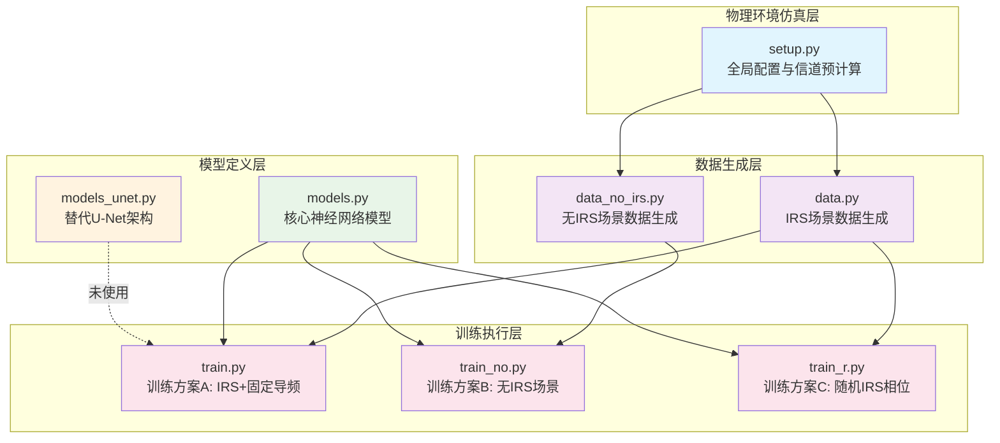

# IRS_Diffu_ISAC 系统架构设计文档

## 1. 项目概述

### 1.1 项目全称
- **IRS** = Intelligent Reflecting Surface（智能反射面）
- **Diffu** = Diffusion Model（扩散模型）
- **ISAC** = Integrated Sensing and Communication（通感一体化）

### 1.2 项目目标
本项目是一个基于 PyTorch 的深度学习研究项目，核心目标是：**在通感一体化（ISAC）场景下，利用智能反射面（IRS）辅助的无线通信物理信号，通过扩散模型实现 3D 目标点云重建（感知任务）**。

系统模拟了一个无线通信场景：基站（BS）发射导频信号，经由 ROI（Region of Interest，感兴趣区域）中的物体散射后，到达用户设备（UE），同时信号路径可能经过两块 IRS 反射面。通过分析接收到的信号，系统学习从物理信号特征中重建 3D 空间中的物体点云。

### 1.3 技术栈
- **深度学习框架**: PyTorch
- **数值计算**: NumPy, SciPy
- **可视化**: Matplotlib
- **编程语言**: Python 3.x

---

## 2. 系统架构图

### 2.1 模块依赖关系图



### 2.2 数据流架构图

```mermaid
flowchart TB
    subgraph "输入层"
        BS[基站 BS<br/>4天线]
        IRS1[IRS1<br/>4×4阵列]
        IRS2[IRS2<br/>4×4阵列]
        UE[用户设备 UE<br/>4天线]
        ROI[ROI区域<br/>16×16×16体素]
    end
    
    subgraph "物理信号仿真"
        channel[信道预计算<br/>H_dict: 11个信道矩阵]
        signal[信号生成<br/>Y = H_total × X + N<br/>5条传播路径]
    end
    
    subgraph "数据处理"
        voxel[体素生成<br/>随机物体模板]
        pc[点云提取<br/>2048个点]
        feat[特征提取<br/>[幅值, sin相位, cos相位]]
    end
    
    subgraph "深度学习管线"
        vae[PointVAE<br/>点云→潜在空间<br/>2048×3 → 256]
        cond_enc[AdvancedCondEncoder<br/>LSTM+Transformer<br/>8×88 → 8×256]
        dit[LatentDiT1D<br/>条件扩散模型<br/>DiT+交叉注意力]
        ddpm[DDPM采样<br/>1000步反向扩散]
    end
    
    subgraph "输出层"
        recon[重建点云<br/>2048×3]
    end
    
    BS --> channel
    IRS1 --> channel
    IRS2 --> channel
    ROI --> channel
    channel --> signal
    ROI --> voxel
    voxel --> pc
    signal --> feat
    
    pc --> vae
    feat --> cond_enc
    vae --> dit
    cond_enc --> dit
    dit --> ddpm
    ddpm --> vae
    vae --> recon
    
    style BS fill:#bbdefb
    style IRS1 fill:#c8e6c9
    style IRS2 fill:#c8e6c9
    style UE fill:#bbdefb
    style ROI fill:#fff9c4
    style vae fill:#e1bee7
    style cond_enc fill:#e1bee7
    style dit fill:#ffcdd2
    style recon fill:#dcedc8
```

---

## 3. 核心模块详解

### 3.1 `setup.py` — 全局配置与信道预计算

**职责**: 定义仿真环境的物理参数和预计算所有必要的信道矩阵。

#### 关键参数

| 参数 | 值 | 含义 |
|------|-----|------|
| `Tau` | 8 | 时间帧数（每轮信号仿真8个时间步） |
| `P_SNR` | 20 dB | 信噪比 |
| `Power_sigma` | 0.01 | 噪声功率 |
| `ROI_Length` | 16 | ROI体素网格尺寸（16×16×16） |
| `N_IRS` | 4 | 每块IRS的单维度元素数 |
| `IRS_total` | 32 | IRS元素总数（2块IRS × 4×4 = 32） |
| `BS_Number` | 4 | 基站天线数 |
| `UE_Number` | 4 | 用户设备天线数 |

#### 坐标配置
- **基站位置** `pBS`: [-4, 0.5, 2] 附近4个天线
- **用户位置** `pUE`: [2, ~, 0] 附近4个天线
- **IRS1位置** `pIRS_P1`: [1.0, 2.0, 1.0]
- **IRS2位置** `pIRS_P2`: [-1.0, -1.0, 1.0]

#### 核心函数
- `get_Channel(a, b)`: 基于自由空间路径损耗模型计算信道矩阵
- `make_irs_rotated()`: 生成经旋转的IRS阵列坐标
- `make_roi_grid()`: 生成16×16×16的ROI空间网格坐标
- `precompute_channels(device)`: 预计算所有链路信道矩阵，返回 `H_dict` 字典

#### 预计算的信道矩阵（`H_dict`）
- `H_ROI_UE`: ROI → UE
- `H_IRS1_UE`, `H_IRS2_UE`: IRS → UE
- `H_ROI_IRS1`, `H_ROI_IRS2`: ROI → IRS
- `H_IRS1_ROI`, `H_IRS2_ROI`: IRS → ROI
- `H_BS_ROI`: BS → ROI
- `H_BS_IRS1`, `H_BS_IRS2`: BS → IRS

---

### 3.2 `data.py` — IRS 场景数据生成

**职责**: 为 IRS 辅助场景生成训练数据（ROI体素 + 点云 + 物理信号条件）。

#### 核心组件

| 函数/类 | 职责 |
|---------|------|
| `generate_ROI()` | 在16×16×16空间中随机放置1个预定义物体（4种模板） |
| `extract_point_cloud_from_voxel()` | 从体素网格中提取2048个点的点云 |
| `data_progress_amp_phase()` | 将复数信号转换为 [幅值, sin(相位), cos(相位)] 特征向量 |
| `calculate_value_ROI_simple()` | **核心物理方程**：计算 IRS 场景下的接收信号 |
| `ROIPairedDataset` | PyTorch Dataset，每个样本输出 (点云, 条件信号) 对 |

#### IRS 场景信号模型（5条路径）
```
H_total = H_BS_ROI_UE              (BS → ROI → UE)
        + H_BS_ROI_IRS1_UE          (BS → ROI → IRS1 → UE)
        + H_BS_ROI_IRS2_UE          (BS → ROI → IRS2 → UE)
        + H_BS_IRS1_ROI_UE          (BS → IRS1 → ROI → UE)
        + H_BS_IRS2_ROI_UE          (BS → IRS2 → ROI → UE)
```

#### 条件信号维度
每帧88维 = X特征(12) + Y特征(12) + IRS相位特征(64)，共Tau=8帧，总条件维度 [8, 88]。

---

### 3.3 `data_no_irs.py` — 无IRS场景数据生成

**职责**: 为无IRS辅助的对比场景生成训练数据。

#### 与 `data.py` 的关键区别
- 信号模型简化为仅 BS → ROI → UE 的单路径反射
- 增加了**遮挡模拟** `apply_occlusion_to_roi()`
- 使用 **16QAM 调制**生成固定导频向量
- 包含点云归一化/反归一化函数

---

### 3.4 `models.py` — 核心神经网络模型

#### (1) PointVAE — 点云变分自编码器

**架构**:
- **编码器**: 5层 Conv1d + BatchNorm + ReLU → MaxPool → fc_mu / fc_logvar
- **输入**: [B, 2048, 3] 点云
- **潜在空间**: z_dim = 256
- **解码器**: 3层 MLP → reshape 为 [B, 2048, 3]

**损失函数**: Chamfer Distance + KL散度

#### (2) AdvancedCondEncoder — 条件信号编码器

**架构**:
- 双向LSTM(2层) → LayerNorm投影 → Transformer Encoder(2层, 4头) → 最终投影
- **输入**: [B, 8, 88] 或 [B, 8, 114] 物理信号序列
- **输出**: [B, 8, 256] 条件嵌入序列

#### (3) LatentDiT1D_CrossAttn — 条件潜在扩散模型

**架构**: Diffusion Transformer (DiT) with Cross-Attention
- 将256维潜在向量拆分为16个token（每个token_dim=16）
- **核心组件**:
  - `TimestepEmbedder`: 正弦位置编码 + MLP
  - `DiTBlock_CrossAttn`（4层）: 自注意力 + 交叉注意力 + AdaLN调制的MLP
  - `FinalLayer`: AdaLN调制的线性投影
- **输入**: 噪声潜在向量 zt [B, 256]、时间步 t [B]、条件序列 [B, 8, 256]
- **输出**: 预测噪声 eps [B, 256]
- **支持 Classifier-Free Guidance (CFG)**

---

### 3.5 `models_unet.py` — 替代 U-Net 扩散模型

**当前状态**: 定义了完整的 U-Net 1D 架构，但**未被任何训练脚本引用**（备选/实验架构）。

---

## 4. 训练流程

### 4.1 两阶段训练管线

```
阶段1：PointVAE 预训练
┌─────────────┐     ┌──────────────┐     ┌───────────────┐
│ 点云输入     │ ──→ │ PointVAE编码  │ ──→ │ 潜在空间 z=256 │
│ [B,2048,3]  │     │              │     │               │
└─────────────┘     └──────────────┘     └───────────────┘
      ↕ 编码-解码重建, 损失 = CD + KL

阶段2：Latent Diffusion 训练
┌──────────┐     ┌──────────────────┐     ┌──────────────┐
│ 条件信号  │ ──→ │ AdvancedCondEnc  │ ──→ │ 条件嵌入 [8,256]│
│ [B,8,88] │     │ (LSTM+Transformer)│     └──────┬───────┘
└──────────┘     └──────────────────┘            │
                                                  ↓ 交叉注意力
┌──────────┐     ┌──────────────────┐     ┌──────────────┐
│ 潜在向量z │ ──→ │ 加噪到 zt        │ ──→ │ LatentDiT    │ → 预测噪声 eps
│ [B,256]  │     │ (DDPM前向)       │     │ (DiT+CrossAttn)│
└──────────┘     └──────────────────┘     └──────────────┘
```

### 4.2 训练脚本对比

| 脚本 | IRS状态 | 信号路径 | 条件维度 | 目的 |
|------|---------|---------|----------|------|
| `train.py` | IRS启用 | 5条路径 | 88维 | IRS辅助性能基准 |
| `train_no.py` | 无IRS | 仅BS-ROI-UE | 128维 | 无IRS基线对比 |
| `train_r.py` | 随机IRS相位 | 5条路径（随机相位） | 88维 | IRS随机相位效果 |

---

## 5. 依赖关系

### 5.1 外部依赖

| 库 | 用途 |
|----|------|
| `torch` | 深度学习框架（模型定义、训练、推理） |
| `numpy` | 数值计算（体素生成、信道矩阵、点云处理） |
| `scipy.spatial.transform.Rotation` | IRS阵列旋转计算 |
| `matplotlib` | 训练损失曲线绘制、结果可视化 |
| `math` | 数学运算 |

### 5.2 内部模块依赖关系

```
setup.py  ←──────────────────────────────────────┐
    ↑      ↑                                     │
    │      │                                     │
data.py   data_no_irs.py                         │
    ↑         ↑                                  │
    │         │                                  │
models.py     │                                  │
    ↑    ↑    │                                  │
    │    │    │                                  │
train.py  train_r.py  train_no.py               │
  ↑          ↑           ↑                       │
  │          │           │                       │
  └──────────┴───────────┴───────────────────────┘
              (都依赖 setup.py)
```

---

## 6. 设计模式与架构特点

### 6.1 两阶段训练管线（Staged Training Pipeline）
这是整个项目最核心的设计模式：
1. **第一阶段（VAE）**: 学习点云的低维潜在表示
2. **第二阶段（LDM）**: 在潜在空间中学习条件扩散生成

VAE训练完成后被冻结，仅作为编码/解码工具。

### 6.2 Latent Diffusion Model (LDM) 架构
参考 Stable Diffusion 的设计思路，在潜在空间而非原始数据空间进行扩散，大幅降低计算成本。

### 6.3 Classifier-Free Guidance (CFG)
训练时随机丢弃条件信号（概率 `cond_drop_prob=0.1`），推理时使用 CFG 公式：
```
eps = eps_uncond + cfg_scale * (eps_cond - eps_uncond)
```

### 6.4 物理信息驱动的条件编码
不同于传统图像扩散模型使用文本条件，本项目使用**物理信号特征**作为条件：
- 发射信号X的幅值/相位特征
- 接收信号Y的幅值/相位特征
- IRS反射相位状态

条件编码器采用 **LSTM + Transformer** 混合架构，捕捉时间序列中的物理信息。

### 6.5 对比实验设计
三种训练脚本对应三种实验条件，便于对比IRS的增益效果。

---

## 7. 维度流转

### 7.1 数据维度变化

```
点云: [B, 2048, 3] → PointVAE.encode → [B, 256] → 标准化 → [B, 256] → 拆分为16 tokens [B, 16, 16]
                                                                                 ↓
条件: [B, 8, 88/128] → AdvancedCondEncoder → [B, 8, 256] ──→ 交叉注意力 ──────→ DiT Block
                                                                                 ↓
噪声: [B, 256] ──→ DiT (自注意力+交叉注意力+MLP) → [B, 256] 预测噪声
```

### 7.2 信号处理流程

1. **物理信号生成**: 8个时间步，每步包含发射信号X、接收信号Y、IRS相位
2. **特征提取**: 复数信号 → [幅值, sin(相位), cos(相位)] → 88维向量
3. **条件编码**: LSTM捕捉时序依赖 → Transformer提取全局特征 → 256维嵌入
4. **扩散过程**: 1000步DDPM，从纯噪声逐步去噪
5. **点云重建**: VAE解码器将潜在向量转换为2048×3点云

---

## 8. 已知问题与改进方向

### 8.1 代码不一致性

| 问题 | 详情 |
|------|------|
| **类名不匹配** | `train_no.py` 和 `train_r.py` 导入 `LatentDiT_Token_CrossAttn`，但 `models.py` 中实际定义的类名为 `LatentDiT1D_CrossAttn` |
| **PointVAE参数不匹配** | `train_no.py`/`train_r.py` 使用 `hidden_dim, token_dim, num_latent_tokens` 参数实例化 PointVAE，但 `models.py` 中 PointVAE 仅接受 `num_points` 和 `z_dim` |
| **decode返回值不匹配** | `train_no.py`/`train_r.py` 中 `vae.decode()` 解包为 `(recon_pred, _)`（元组），但 `models.py` 中 `decode()` 仅返回单个张量 |
| **models_unet.py 未使用** | `UNet1DLatent` 定义了完整的 U-Net 架构，但没有被任何训练脚本引用 |

### 8.2 潜在改进方向

1. **统一接口**: 修复上述不一致性，确保所有训练脚本使用一致的模型接口
2. **模型选择**: 集成 `models_unet.py` 作为可选架构
3. **数据增强**: 增加更多物体模板和随机化策略
4. **评估指标**: 添加点云质量评估指标（如F-Score、Earth Mover's Distance）
5. **可视化**: 增加训练过程可视化和结果展示

---

## 9. 快速开始

### 9.1 环境要求
```bash
pip install torch numpy scipy matplotlib
```

### 9.2 运行训练
```bash
# 方案A: IRS + 固定导频
python train.py

# 方案B: 无IRS场景
python train_no.py

# 方案C: 随机IRS相位
python train_r.py
```

### 9.3 输出文件
- `./model/`: 保存的模型权重
- `./outputs_npy/`: 重建的点云数据（.npy格式）

---

## 10. 总结

IRS_Diffu_ISAC 是一个将**无线通信物理层仿真**与**深度生成模型**相结合的研究项目。它构建了一个端到端的管线：

**物理仿真（信道建模）→ 数据生成（体素/点云/信号）→ VAE潜在编码 → 条件扩散模型训练 → 点云重建**

项目通过对比有IRS/无IRS/随机IRS相位三种场景，系统性地研究了智能反射面对通感一体化系统中3D感知性能的影响。架构设计上采用了 LDM + DiT 的前沿方案，条件编码使用了 LSTM-Transformer 混合架构来处理时序物理信号，并支持 Classifier-Free Guidance 来提升生成质量。